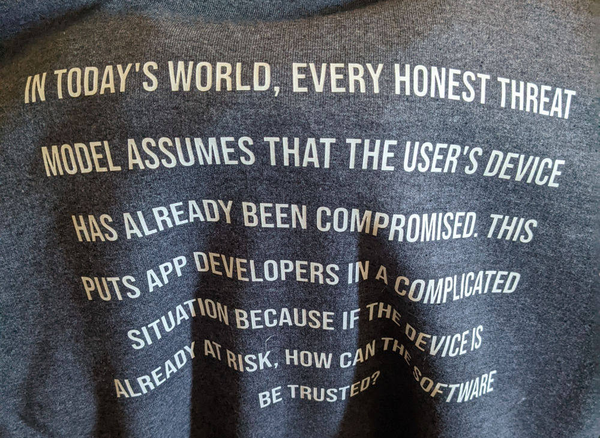
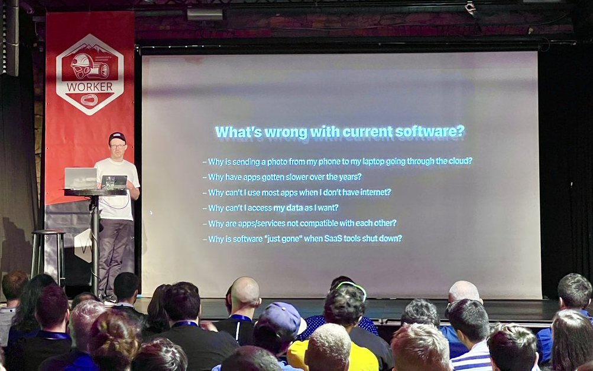

# Tauri 1.0 Release

After 9 months of betas and 4 months of release candidates, [Tauri version 1.0 is now available!](https://github.com/tauri-apps/tauri)

<!--truncate-->

## What is Tauri?

Tauri is an app construction toolkit that lets you build software for all major desktop operating systems using web technologies. The core libraries have been written for you in Rust and the user interface can be written using virtually any frontend framework. It includes an optional and tree-shakeable JavaScript API for comfortable low-level system access, a desktop binary bundler with code signing and artifact verification, a secure updater to keep your users on the latest version, an extensive plugin system, and support for OS-level integrations such as notifications and app trays.

Tauri is as simple to use as it is easy to extend. For those new to the Rust programming language, Tauri provides a comfortable learning environment that will grow with you. Once you have installed Rust, creating your first app is a mere running of [`create-tauri-app`](https://github.com/tauri-apps/create-tauri-app). But you don't have to use Node.js at all, if you would prefer to remain in the safety and comfort of 100% Rust.

See our [Quick Start guides](/v1/guides/getting-started/setup/) to start building with Tauri.

## Tauri Philosophy

We built Tauri for the security-focused, privacy-respecting, and environmentally-conscious software engineering community.

### Security

The entire project has been [horizontally and vertically audited by an independent third party](https://github.com/tauri-apps/tauri/blob/dev/audits/Radically_Open_Security-v1-report.pdf), and we maintain a very strict approach to updating the core. We want you to be confident that major versions are as safe to use as they are ergonomic.

<figure>

<figcaption>
  <i>Hoodie by jprovost</i>
</figcaption>

</figure>

### Privacy

Tauri allows you to build "[local first](https://twitter.com/schickling/status/1537134435702714368?cxt=HHwWgMClwYHo_9QqAAAA)" applications without a webserver, so your users don't have to share their data with big tech. Using local databases and rust based cryptography have never been easier.

<figure>

<figcaption>
  <i>
    Johannes Schickling at Worker Conf 2022 (photo by{' '}
    <a href="https://twitter.com/TejasKumar_">@TejasKumar via Twitter</a>)
  </i>
</figcaption>

</figure>

### Environment

The apps you make are lean and performant, which reduces electricity, storage space, and general natural resource consumption. Every byte saved is a leaf on a tree that gets to grow.

To illustrate this, we compiled some numbers on the ecological impact of your app's size. As you can see, even small increases in size have a hefty impact on the environment!

<figure>

| App Size | Unit Time (100Mb/s) | Downloads  | Transit | Total Time (100Mb/s) | Electricity Use (kWh) | CO2 Produced (Ton) | Trees Needed 🌳 |
| -------- | ------------------- | ---------- | ------- | -------------------- | --------------------- | ------------------ | --------------- |
| 3 MB     | 240 milliseconds    | 1,000      | 3 GB    | 24 minutes           | 0.3                   | 0.18               | 1               |
| 3 MB     | 240 milliseconds    | 100,000    | 300 GB  | 1.7 days             | 30                    | 18                 | 108             |
| 3 MB     | 240 milliseconds    | 10,000,000 | 30 TB   | 167 days             | 3,000                 | 1,800              | 10,800          |
| 200 MB   | 16 seconds          | 1,000      | 200 GB  | 4.45 hours           | 20                    | 12                 | 72              |
| 200 MB   | 16 seconds          | 100,000    | 20 TB   | 18.5 days            | 2,000                 | 1,200              | 7,200           |
| 200 MB   | 16 seconds          | 10,000,000 | 2 PB    | 5 years              | 200,000               | 120,000            | 720,000         |
| 600 MB   | 48 seconds          | 1,000      | 0.6 TB  | 13 hours             | 60                    | 36                 | 216             |
| 600 MB   | 48 seconds          | 100,000    | 60 TB   | 54.2 days            | 6,000                 | 3,600              | 21,600          |
| 600 MB   | 48 seconds          | 10,000,000 | 6 PB    | 14.8 years           | 600,000               | 360,000            | 2,160,000       |

<figcaption>

_The transmission of 1 GB of information takes an estimated 0.1kWh, which is equal to 0.06 kilograms of CO2. (https://www.emergeinteractive.com/insights/detail/does-irresponsible-web-development-contribute-to-global-warming/)_

_Although the carbon absorption capacity can vary, it is generally considered that a tree can store about 167 kg of CO2 per year, or 1 ton of CO2 per year for 6 mature trees (https://climate.selectra.com/en/news/co2-tree)_

</figcaption>
</figure>

### Community

We know that open source software is a means of fostering equality and collaboration, which is why we placed the [ownership of the code at the Commons Conservancy](https://dracc.commonsconservancy.org/0035/). You can rest assured knowing that the code base will never be rug-pulled or locked behind open-core pay-to-play feature gates. We believe in open collaboration and safe spaces for all. We have an open working group, accessible to any competent contributors. And we love you all. ❤️

## Accolades

Here are some of the things people are saying about Tauri:

_"Spacedrive had to feel native across all platforms, all while being lightweight, instant to launch and extremely fast to use. This just wasn't possible with a web-based UI — until now, thanks to Tauri."_  
**- Jamie Pine**, [Spacedrive](https://www.spacedrive.com) Founder

 

_"Tauri has the potential to unlock a new generation of desktop software that feels native to users but is as easy to build as web apps."_

**- Johannes Schickling**, [Prisma](https://www.prisma.io) Founder

 

_"Tauri stands to reduce the disastrously negative environmental costs of bloated and memory-hogging applications on the internet by orders of magnitude. Any rough approximation of monetary value that could result in, would easily reach hundreds of billions in cost savings for our modern era of grossly underutilized local compute and storage resources."_

**- Joseph Jacks**, [OSS Capital](https://oss.capital) Founder / GP

 

_"With its security-focused design and low memory footprint, Tauri is the electron alternative we've been waiting for. Tauri has allowed us to build a more secure, more performant desktop app while using the same web technologies, which we love. Thanks to the team for their amazing work!_  
_P.S.: Can't wait for mobile support!"_

**- Martin Kleinschrodt**, [Padloc](https://padloc.app/) Founder

## Feedback

You can visit our code base, file a bug-report, request a feature, or join the discussion on [GitHub](https://github.com/tauri-apps/tauri). There's lots of things that people make, and visiting the [awesome-tauri repo on GitHub](https://github.com/tauri-apps/awesome-tauri) is a great place to discover and share. If you need support or just want to hang out, you can [join our Discord server](https://discord.gg/tauri).

Tauri is one of the top 200 projects on GitHub in all programming languages.

<figure>

<figcaption>
</figcaption>
</figure>

People love to discuss what is great and terrible about Tauri on orange websites:

<figure>

<figcaption>
</figcaption>
</figure>

Tauri entered at the top of the charts for the [2021 edition of State of JS](https://2021.stateofjs.com/en-US/libraries/mobile-desktop):

<figure>

<figcaption>
</figcaption>
</figure>

Engineers at big companies seem to be eying up Tauri for future projects.

<figure>

<figcaption>

[OSS Insight](https://api.ossinsight.io/share/e0a8c3f4-a28f-48ac-b541-7b19fe08975b)

</figcaption>
</figure>

## What's Next?

Fresh off the heels of the 1.0 release, the team is already setting our sights on the next steps for Tauri. While we continuously work on improving our documentation, we're also working on:

- Mobile support for both iOS and Android
- Alternative renderers
- IPC enhancements to enable improved debugging
- Runtime plugins
- Support for additional bindings in other languages

We're also inspired by the community to see which features are being used and what new features will enable them to develop even more amazing applications. Your feedback is the most important thing to Tauri's future innovation!

## Thank You

A special thanks to all our contributors who volunteered their precious time to make Tauri awesome and all our sponsors whose generous donations made Tauri possible (and financed a large portion of our audit!)!

The support of industry giants has been really helpful keeping the lights on. Here's an alphabetical list:

- [Cloudflare](https://www.cloudflare.com/) for sponsoring unlimited workers for the OSS updater service (coming soon)
- [DigitalOcean](https://www.digitalocean.com/) for comping the droplets that run our bots and search
- [GitHub](https://github.com) for the extra minutes of CI
- [Netlify](https://www.netlify.com/) for our website hosting
- [NLNET](https://nlnet.nl/) who has financially supported Tauri development via grants
- [PACKT](https://www.packtpub.com/) who will be publishing our books

Here are a few notable contributors we'd like to thank explicitly:

| GitHub Profile    | Contribution                                                                                     | Repository                              |
| :---------------- | :----------------------------------------------------------------------------------------------- | :-------------------------------------- |
| @malyn            | Fixed http stream                                                                                | `wry`                                   |
| @wravery          | windows-rs support, webview2-rs                                                                  | `tao`, `wry`                            |
| @liushuyu         | Added headers feature to webkit2gtk                                                              | `wry`                                   |
| @emirror-de       | System tray support                                                                              | `tao`                                   |
| @lorenzolewis     | tauri.app updates                                                                                | `tauri-docs`                            |
| @probablykasper   | Support for more accelerators, restructured documentation                                        | `tao`, `tauri-docs`                     |
| @grbd             | Added an example to use tauri as a C++ DLL                                                       | `tauri`                                 |
| @youngsing        | Added macOS vibrancy                                                                             | `tauri-plugin-vibrancy`                 |
| @lemarier         | Updater, menus, system tray, iOS, clipboard api, bytes-stream & ++                               | `wry`, `tao`, `tauri`                   |
| @JonasKruckenberg | Tauri plugin upgrades and documentation overhaul                                                 | `tauri-plugin-*`, `tauri-docs`          |
| @ImmaZoni         | Code signing guides for macOS and Windows                                                        | `tauri-docs`                            |
| @chippers         | Isolation pattern, shell scope, compile-time code generation and several other security features | `tauri`                                 |
| @fabianlars       | Community support, AppImage fixes, code review                                                   | all repos, mainly `tauri`, `tauri-docs` |
| @amrbashir        | TAO and WRY features and fixes, overall OS guru                                                  | `tao`, `wry`                            |
| @wusyong          | TAO and WRY founder and researcher                                                               | `tao`, `wry`                            |
| @nklayman         | custom protocol                                                                                  | `tauri`                                 |

 

---

 

We'd like to wrap up by highlighting comments from just a small handful of core Tauri contributors:

#### [Amr Bashir](https://github.com/amrbashir)

**What feature are you most excited about?**  
The customizations we offer for the window but that's because it is what I mostly worked on. I am also excited about how Tauri will change the mindset of some people and help them build secure apps by default.

**What is your proudest moment/contribution with Tauri?**  
Probably when I removed about 20 lines of code in favor of only 3 lines. I wrote both and that's why it felt special, because it was an indicator of how much I've grown as a developer.

#### [Chip Reed](https://github.com/chippers)

**What feature are you most excited about?**  
Not needing to use `--locked` when installing the CLI.

**What is your proudest moment/contribution with Tauri?**  
Building the Isolation Pattern

#### [Didrik Nordström](https://github.com/betamos/)

**What feature are you most excited about?**  
File drag & drop.

**What is your proudest moment/contribution with Tauri?**  
Quality/stability: Tracking down and fixing a segmentation fault: https://github.com/h4llow3En/mac-notification-sys/pull/40

#### [Fabian-Lars](https://github.com/FabianLars)

**What feature are you most excited about?**  
Is "All of them" a valid answer?

**What is your proudest moment/contribution with Tauri?**  
Hmm, probably when I was asked to join the team. Fixing AppImages again and again and again is a close second...

#### [Jonas Kruckenberg](https://github.com/JonasKruckenberg)

**What feature are you most excited about?**  
The auto-updater is pretty great but plugins are very dear to me and definitely the most promising feature of Tauri!

**What is your proudest moment/contribution with Tauri?**  
Moderating the tauri-awesome repo. Seeing so many strangers build cool things with and for the work you've been doing. That's a really great feeling.

#### [Kasper Henningsen](https://github.com/probablykasper)

**What inspired you to join Tauri?**  
I was making a few Tauri apps, and just found some features/improvements I wanted to go for.

#### [Laegel](https://github.com/laegel)

**What feature are you most excited about?**  
It may sound silly but I love customizing stuff, so the possibility to make almost anything with our windows appearance is neat.

**What is your proudest moment/contribution with Tauri?**  
Creating the foundations of Tauri docs as we know them today and trying to provide clean and easy to understand docs.

#### [lemarier](https://github.com/lemarier)

**What feature are you most excited about?**  
Pretty much everything, getting Tauri out of a proof of concept to something stable is a huge milestone.

**What is your proudest moment/contribution with Tauri?**  
TAO and all under laying features (menus, trays, etc..), benchmarks and the proof of concept for iOS.

#### [Lorenzo Lewis](https://github.com/lorenzolewis)

**What feature are you most excited about?**  
Overall resource efficiency. We've all been where we have a handful of "native" web apps running on our machine and it grinds to a halt. I'm ready for those small bundle sizes!

**What is your proudest moment/contribution with Tauri?**  
The overall tauri.app website. It was in a really good place when I joined, but I knew I could help boost it up to the next level. Even things like picking a title for a sidebar can take a long time with all the discussions, but at the end of the day we all have the best output from putting our heads together.

#### [Lucas Nogueira](https://github.com/lucasfernog)

**What feature are you most excited about?**  
Plugins!

**What are you most excited about now that the launch is through?**  
MOBILE and the upcoming egui integration launch

#### [Noah Klayman](https://github.com/nklayman)

**What feature are you most excited about?**  
Auto-updater. It's really hard to get something that complex right and Tauri has done a fantastic job.

**What is your proudest moment/contribution with Tauri?**  
Getting the custom protocol based asset loader to work, especially on Windows.

#### secdude

**What feature are you most excited about?**  
Conditional compilation of features by default.

**What is your proudest moment/contribution with Tauri?**  
:shrug: v1 I guess

#### [Wu Yu-Wei](https://github.com/wusyong)

**What feature are you most excited about?**  
Auto-updater I think. A built-in OTA feature feels pretty handy.

**What is your proudest moment/contribution with Tauri?**  
Published wry crate and particular in this commit: https://github.com/tauri-apps/wry/commit/722e1212a4795f5f81638667cbd31bc53a5d27ed
