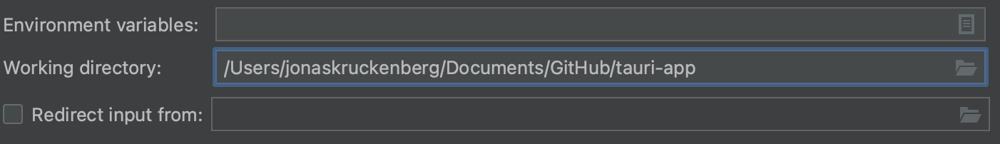

# Debugging in CLion

In this guide, we’ll be setting up IntelliJ CLion for debugging the [Core Process of your Tauri app].

## Prerequisites

You need to install the [IntelliJ Rust Plugin](https://plugins.jetbrains.com/plugin/8182-rust/docs) that Rust features are enabled.

## Top-level Cargo Workspace

By default Tauri places the Rust project in a subdirectory called `src-tauri`. CLion doesn't recognize Cargo projects that are not at the top-level like this, so we need to create a top-level Workspace that just points to our main `Cargo.toml` file: 

```toml title=Cargo.toml
[workspace]
members = ["src-tauri"]
```

Before you proceeed, make sure that your project is fully loaded. If the indexing is finished and the Cargo tool window shows all the modules and targets of the workspace, you’re good to go.

## Run/Debug Configuration

We will set up a Run/Debug configuration that we can use to launch our Tauri app in debugging mode. To create a configuration, go to Edit Configurations, click **+**, and then select Cargo Command.


With that created we need to configure a few options so that CLion can properly launch our app. The first one is setting the Working Directory. CLion will not recognize our configuration as valid until we set one, so let's set it to the root of our project.



Next we need to instruct Cargo to build our app without any default features. This will tell Tauri to use your development server instead of reading assets from disk. Normally this flag is passed by the Tauri CLI, but since we're completely sidestepping that here, we need to pass the flag manually.


Now we can optionally rename the Run/Debug Configguration to something more memorable, in this example we called it "Run Tauri App", but you can name it whatever you want.


## Launch the Development Server

The above configuration will use Cargo directly to build the Rust application and attach the debugger to it. This means we completely sidestep the Tauri CLI, so features like the `beforeDevCommand` and `beforeBuildCommand` will **not** be executed. We need to take care of that by opening a new Terminal and starting running the development server manually:

```sh
pnpm vite dev
```

## Launch a Debugging Session

With the development server running and the Run/Debug Configuration selected in the Switcher, you can now start a new debugging session by clicking Debug `Ctrl+D` on Windows/Linux, `⌃D` on macOS). CLion will automatically recognize breakpoints placed in any Rust file in your project.

[core process of your tauri app]: ../../references/architecture/process-model.md#the-core-process
