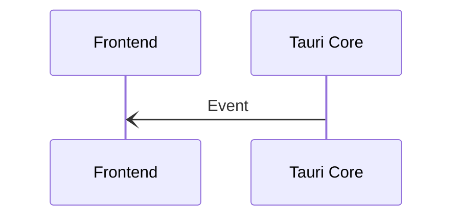
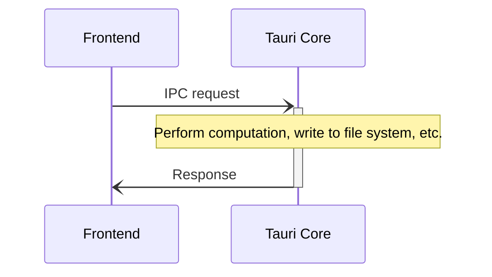

# Communication inter-processus

La communication inter-processus (IPC) permet aux processus isolés de communiquer en toute sécurité et est essentielle pour créer des applications plus complexes.

Tauri utilise un style particulier de communication inter-processus appelé [Asynchronous Message Passing][], où les processus échangent des _requêtes_ et des _réponses_ sérialisées à l'aide d'une représentation simple des données. La transmission de messages devrait sembler familière à toute personne ayant une expérience en développement Web, car ce paradigme est utilisé pour la communication client-serveur sur Internet.

La transmission de messages est une technique plus sûre que la mémoire partagée ou l'accès direct aux fonctions, car le destinataire est libre de rejeter ou d'ignorer les demandes comme bon lui semble. Par exemple, si le processus Tauri Core détermine qu'une demande est malveillante, il rejette simplement les demandes et n'exécute jamais la fonction correspondante.

Dans ce qui suit, nous expliquons plus en détail les deux primitives IPC de Tauri - `Events` et `Commands`.

## Évènements

Les événements sont des messages IPC unidirectionnels déclenchés et oubliés qui conviennent le mieux pour communiquer les événements du cycle de vie et les changements d'état. Contrairement aux [Commandes](#commands), les événements peuvent être émis à la fois par le frontend _et_ par le noyau Tauri.

<figure>

<figcaption>Figure 1-2 : Un événement envoyé depuis le Core vers le Frontend.</figcaption>
</figure>

## Commandes

Tauri fournit également une abstraction de type [interface de fonction étrangère][] en plus des messages IPC<a href="#fn:1" class="footnote-ref">1</a>. L'API principale, `invoke`, est similaire à l'API `fetch` du navigateur et permet à l'interface d'invoquer des fonctions Rust, de transmettre des arguments et de recevoir des données.

Étant donné que ce mécanisme utilise un protocole de type [JSON-RPC][] sous le capot pour sérialiser les requêtes et les réponses, tous les arguments et les données de retour doivent être sérialisable en JSON.

<figure>

<figcaption>Figure 1-3 : Messages IPC impliqués dans une invocation de commande.</figcaption>
</figure>

<!-- prettier-ignore -->
[^1]: Because Commands still use message passing under the hood, they do not share the same security pitfalls as real FFI interfaces do.

[Asynchronous Message Passing]: https://en.wikipedia.org/wiki/Message_passing#Asynchronous_message_passing
[JSON-RPC]: https://www.jsonrpc.org
[interface de fonction étrangère]: https://en.wikipedia.org/wiki/Foreign_function_interface
