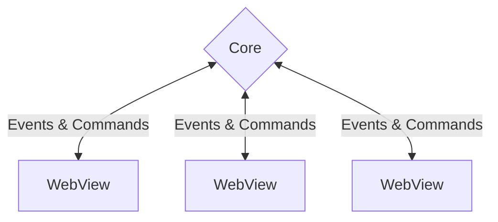

# Gestion des processus

Tauri utilise une architecture multi-processus similaire à Electron ou à de nombreux navigateurs Web modernes. Ce guide explore les raisons du choix de conception et pourquoi il est essentiel pour écrire des applications sécurisées.

## Pourquoi plusieurs processus?

Au début des applications GUI, il était courant d'utiliser un processus unique pour effectuer des calculs, dessiner l'interface et réagir aux entrées de l'utilisateur. Comme vous pouvez probablement le deviner, cela signifiait qu'un calcul long et coûteux laisserait l'interface utilisateur insensible, ou pire, une défaillance dans un composant de l'application entraînerait le blocage de l'ensemble de l'application.

Il est devenu évident qu'une architecture plus résiliente était nécessaire et les applications ont commencé à exécuter différents composants dans différents processus. Cela permet une bien meilleure utilisation des processeurs multicœurs modernes et crée des applications beaucoup plus sûres. Un crash dans un composant n'affecte plus l'ensemble du système, car les composants sont isolés sur différents processus. Si un processus entre dans un état invalide, nous pouvons facilement le redémarrer.

Nous pouvons également limiter le rayon d'explosion des exploits potentiels en ne distribuant qu'un minimum d'autorisations à chaque processus, juste assez pour qu'ils puissent faire leur travail. Ce modèle est connu sous le nom de [principe du moindre privilège][], et vous le voyez dans le monde réel tout le temps. Si vous faites venir un jardinier pour tailler votre haie, vous lui donnez la clé de votre jardin. Vous ne leur donneriez **pas** les clés de votre maison; pourquoi auraient-ils besoin d'y avoir accès ? Le même concept s'applique aux programmes informatiques. Moins nous leur donnons d'accès, moins ils peuvent faire de mal s'ils sont compromis.

## Le processus de base

Chaque application Tauri a un processus central, qui agit comme point d'entrée de l'application et qui est le seul composant avec un accès complet au système d'exploitation.

La principale responsabilité du Core est d'utiliser cet accès pour créer et orchestrer des fenêtres d'application, des menus de la barre d'état système ou des notifications. Tauri implémente les abstractions multiplateformes nécessaires pour faciliter cette tâche. Il achemine également toutes les [communications inter-processus][] via le processus principal, ce qui vous permet d'intercepter, de filtrer et de manipuler les messages IPC dans l'emplacement central.

Le processus principal doit également être responsable de la gestion de l'état global, tel que les paramètres ou les connexions à la base de données. Cela vous permet de synchroniser facilement l'état entre les fenêtres et de protéger vos données sensibles de l'entreprise des regards indiscrets dans le Frontend.

Nous avons choisi Rust pour implémenter Tauri en raison de son concept de [Possession][] qui garantit la sécurité de la mémoire tout en conservant d'excellentes performances.

<figure>

<figcaption>Figure 1-1 : Représentation simplifiée du modèle de processus Tauri. Un seul processus Core gère un ou plusieurs processus WebView.</figcaption>
</figure>

## Le processus WebView

Le processus Core ne restitue pas l'interface utilisateur (UI) elle-même; il lance les processus WebView qui exploitent les bibliothèques WebView fournies par le système d'exploitation. Une WebView est un environnement de type navigateur qui exécute votre code HTML, CSS et JavaScript.

Cela signifie que la plupart de vos techniques et outils utilisés dans le développement Web traditionnel peuvent être utilisés pour créer des applications Tauri. Par exemple, de nombreux exemples Tauri sont écrits à l'aide du framework frontal [Svelte][] et du bundle [Vite][].

Les meilleures pratiques de sécurité s'appliquent également; par exemple, vous devez toujours nettoyer les entrées des utilisateurs, ne jamais gérer les secrets dans le Frontend et, idéalement, reporter autant de logique métier que possible au processus Core pour que votre surface d'attaque reste petite.

Contrairement à d'autres solutions similaires, les bibliothèques WebView ne sont **pas** incluses dans votre exécutable final, mais liées dynamiquement au moment de l'exécution[^1]. Cela rend votre application _considérablement_ plus petite, mais cela signifie également que vous devez garder à l'esprit les différences de plate-forme, tout comme le développement Web traditionnel.

<!-- prettier-ignore -->
[^1]: Actuellement, Tauri utilise [Microsoft Edge WebView2][] sur Windows, [WKWebView][] sur macOS et [webkitgtk][] sous Linux.

[principe du moindre privilège]: https://en.wikipedia.org/wiki/Principle_of_least_privilege
[communications inter-processus]: ./inter-process-communication/readme.md
[Possession]: https://doc.rust-lang.org/book/ch04-01-what-is-ownership.html
[Microsoft Edge WebView2]: https://docs.microsoft.com/en-us/microsoft-edge/webview2/
[WKWebView]: https://developer.apple.com/documentation/webkit/wkwebview
[webkitgtk]: https://webkitgtk.org
[Svelte]: https://svelte.dev/
[Vite]: https://vitejs. dev/
