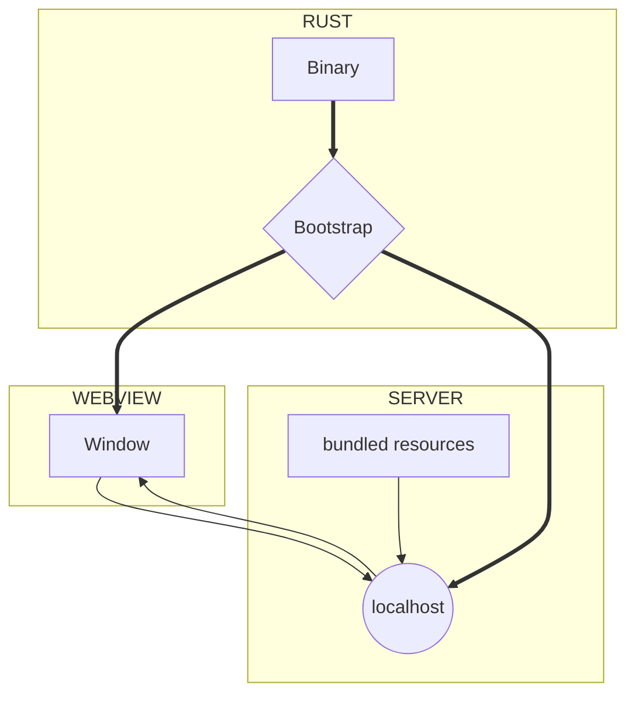

import Rater from '@theme/Rater'
import useBaseUrl from '@docusaurus/useBaseUrl'

<div className="row">
  <div className="col col--4">
    <table>
      <tr>
        <td>Ease of Use</td>
        <td><Rater value="5"/></td>
      </tr>
      <tr>
        <td>Extensibility</td>
        <td><Rater value="3"/></td>
      </tr>
      <tr>
        <td>Performance</td>
        <td><Rater value="3"/></td>
      </tr>
      <tr>
        <td>Sécurité</td>
        <td><Rater value="2"/></td>
      </tr>
    </table>
  </div>
  <div className="col col--4 pattern-logo">
    
  </div>
    <div className="col col--4">
    Pros:
    <ul>
      <li>Similar to a SPA web-app</li>
      <li>No Rust skills required</li>
    </ul>
    Cons:
    <ul>
      <li>No access to Rust API</li>
      <li>Uses a localhost server</li>
    </ul>
  </div>
</div>

## Description

The Cloudish recipe is a pattern for maximum flexibility and app performance. It uses a localhost server, which means that your app will technically be available to other processes, like browsers and potentially other devices on the network. All of your assets are baked into the binary but served as if they were distinct files.

## Diagram



## Configuration

Here's what you need to add to your tauri.conf.json file:

```json
"tauri": {
  "allowlist": {
    "all": false                  // disable entire API
  }
}

```
