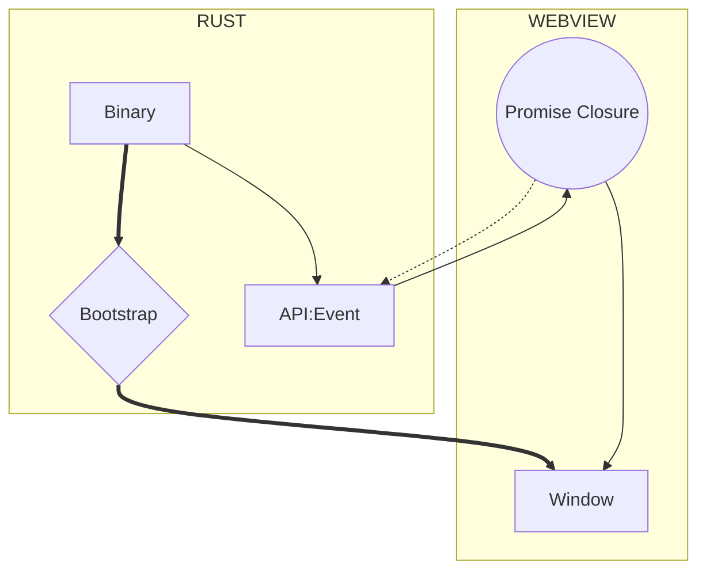

import Rater from '@theme/Rater'
import useBaseUrl from '@docusaurus/useBaseUrl'

<div className="row">
  <div className="col col--4">
    <table>
      <tr>
        <td>Ease of Use</td>
        <td><Rater value="2"/></td>
      </tr>
      <tr>
        <td>Extensibility</td>
        <td><Rater value="4"/></td>
      </tr>
      <tr>
        <td>Performance</td>
        <td><Rater value="5"/></td>
      </tr>
      <tr>
        <td>Sécurité</td>
        <td><Rater value="5" /></td>
      </tr>
    </table>
  </div>
  <div className="col col--4 pattern-logo">
    
  </div>
  <div className="col col--4">
    Pros:
    <ul>
      <li>Highest security rating</li>
      <li>Elegant and powerful</li>
    </ul>
    Cons:
    <ul>
      <li>Rust skills required</li>
      <li>No remote resources</li>
    </ul>
  </div>
</div>

## Description

The Lockdown recipe is a minimal usage of the [Bridge pattern](./bridge), which only allows interaction between Rust and the Window via expiring JS Promise Closures that are injected into the Window by Rust and nulled as part of the callback.

## Diagram



## Configuration

Here's what you need to add to your tauri.conf.json file:

```json
"tauri": {
  "allowlist": {}                  // all API endpoints are default false
}
```
