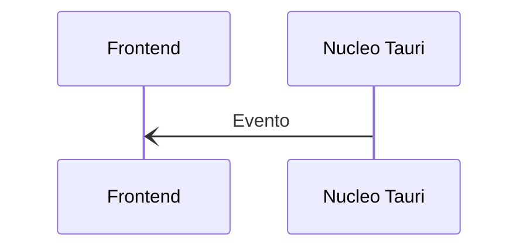
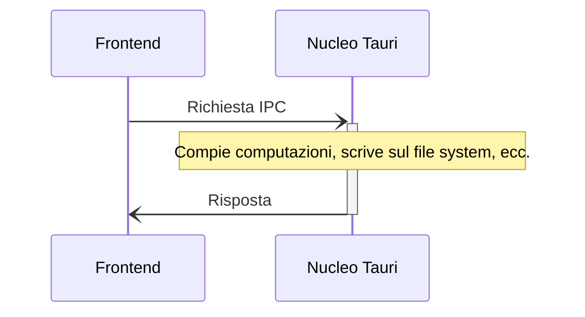

# Comunicazione Inter-Processo (IPC)

La Comunicazione Inter-Processo (IPC) permette a processi isolati di comunicare in sicurezza ed è la chiave per la creazione di applicazioni più complesse.

Tauri utilizza uno stile particolare di Comunicazione Inter-Processo (IPC) chiamato [Passaggio di Messaggi Asincrono][], ove i processi scambiano _richieste_ e _risposte_ serializzate utilizzando qualche semplice rappresentazione del dato. Il Passaggio di Messaggi dovrebbe essere familiare a chiunque con esperienza nello sviluppo web, in quanto questo paradigma è utilizzato per la comunicazione client-server su Internet.

Il passaggio di Messaggi è una tecnica più sicura della memoria condivisa o dell'accesso diretto alle funzioni perchè il destinatario è libero di rifiutare o scartare le richieste come ritiene opportuno. Per esempio, se il processo del Nucleo di Tauri ritiene che una richiesta sia malevola, semplicemente la scarta e non esegue mai la funzione corrispondente.

Di seguito, approfondiamo due primitive IPC di Tauri - `Eventi` e `Comandi` - più nel dettaglio.

## Eventi

Gli eventi sono emetti-e-dimentica, messaggi IPC a senso unico che sono più adatti per comunicare eventi del ciclo di vita e cambiamenti di stato. A differenza dei [comandi](#commands), gli eventi possono essere emessi sia da Frontend _che_ dal Nucleo Tauri.

<figure>

<figcaption>Figura 1-2: Un evento inviato dal Nucleo al Frontend.</figcaption>
</figure>

## Comandi

Tauri inoltre fornisce una [Interfaccia di funzione esterna (FFI)][] come astrazione sopra i messaggi IPC[^1]. L'API primaria, `invoke`, è simile all'API `fetch` del browser e permette al Frontend d'invocare funzioni Rust, passare argomenti, e ricevere dati.

Poiché questo meccanisco utilizza un protocollo simile a [JSON-RPC][] dietro le quinte per serializzare richieste e risposte, tutti gli argomenti e dati ritornati devono essere serializzabili in JSON.

<figure>

<figcaption>Figura 1-3: Messaggi IPC coinvolti nell'invocazione di un comando.</figcaption>
</figure>

<!-- prettier-ignore -->
[^1]: Because Commands still use message passing under the hood, they do not share the same security pitfalls as real FFI interfaces do.

[Passaggio di Messaggi Asincrono]: https://en.wikipedia.org/wiki/Message_passing#Asynchronous_message_passing
[JSON-RPC]: https://www.jsonrpc.org
[Interfaccia di funzione esterna (FFI)]: https://en.wikipedia.org/wiki/Foreign_function_interface
