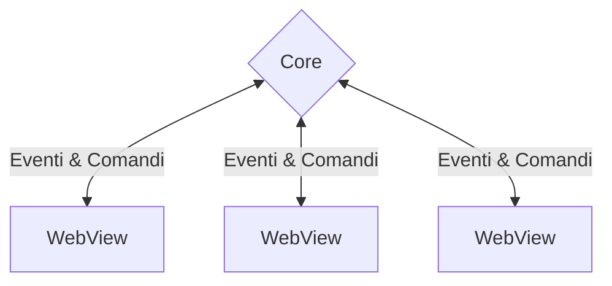

# Modello Processi

Tauri utilizza un'architettura multi-processo simile a Electron o molti browser web moderni. Questa guida esplora le ragioni alla base della scelta dell'architettura e perché è fondamentale per scrivere applicazioni sicure.

## Perché Processi Multipli?

Nei primi giorni delle applicazioni GUI, era comune utilizzare un unico processo per eseguire i calcoli, disegnare l'interfaccia e reagire all'input dell'utente. Come si può probabilmente indovinare, questo significava che un lungo e costoso calcolo lascerebbe l'interfaccia utente non reattiva, o peggio, un guasto in un componente dell'app porterebbe l'intera app in crash.

È diventato chiaro che era necessaria un'architettura più resiliente, e le applicazioni hanno iniziato a gestire componenti diversi in diversi processi. Questo rende migliore l'uso delle CPU multi-core moderne e crea applicazioni molto più sicure. Un crash in un componente non influisce più sull'intero sistema, poiché i componenti sono isolati su processi diversi. Se un processo entra in uno stato non valido, possiamo facilmente riavviarlo.

Possiamo anche limitare il raggio di esplosione di potenziali exploit distribuendo solo la quantità minima di autorizzazioni per ogni processo, quanto basta in modo che possano fare il loro lavoro. Questo modello è conosciuto come il [Principio di Privilegio Minimo][], e lo puoi notare molto spesso nel mondo reale. Se avete un giardiniere che viene per tagliare la siepe, si dà ad esso **solo** la chiave per il vostro giardino. **Non** gli daresti mai le chiavi di casa tua; perche mai dovrebbero averne bisogno? Lo stesso concetto vale per i programmi informatici. Quanto minore è l'accesso a questi ultimi, tanto minore è il danno che possono arrecare se vengono compromessi.

## Il Processo Centrale

Ogni applicazione Tauri ha un processo centrale, che funge da punto di entrata dell'applicazione e che è l'unico componente con pieno accesso al sistema operativo.

La responsabilità primaria del processo centrale è quella di utilizzare quell'accesso per creare e orchestrare le finestre delle applicazioni, i menu di sistema o le notifiche. Tauri implementa le astrazioni multi piattaforma necessarie per renderlo un gioco da ragazzi. It also routes all [Inter-Process Communication][] through the Core process, allowing you to intercept, filter, and manipulate IPC messages in one central place.

Il processo principale dovrebbe inoltre essere responsabile della gestione dello stato globale, come le impostazioni o le connessioni al database. Questo ti permette di sincronizzare facilmente lo stato tra le finestre e proteggere i tuoi dati sensibili da occhi indiscreti nel Frontend.

We chose Rust to implement Tauri because of its concept of [Ownership][] guarantees memory safety while retaining excellent performance.

<figure>

<figcaption>Figura 1-1: Rappresentazione semplificata del modello processi di Tauri. Un singolo processo centrale gestisce uno o più processi WebView.</figcaption>
</figure>

## Il Processo WebView

Il processo Core non disegna l'interfaccia utente vera e propria (UI); fa girare i processi WebView che sfruttano le librerie WebView fornite dal sistema operativo. Una WebView è un ambiente simile al browser che esegue HTML, CSS, e JavaScript.

Ciò significa che la maggior parte delle tecniche e degli strumenti utilizzati nello sviluppo web tradizionale possono essere utilizzati per creare applicazioni Tauri. Ad esempio, molti esempi di Tauri sono scritti utilizzando il frontend framework [Svelte][] e il bundler [Vite][].

Si applicano anche le migliori pratiche in materia di sicurezza; per esempio, è necessario sempre igienizzare l'input dell'utente, non gestire mai i dati sensibili nel frontend, e idealmente rinviare il più possibile la logica al processo Core per mantenere la vostra superficie di attacco piccola.

Unlike other similar solutions, the WebView libraries are **not** included in your final executable but dynamically linked at runtime[^1]. Questo rende la tua applicazione _significativamente_ più piccola, ma significa anche che è necessario tenere a mente le differenze di piattaforma, proprio come lo sviluppo di web tradizionale.

<!-- prettier-ignore -->
[^1]: Attualmente, Tauri utilizza [Microsoft Edge WebView2][] su Windows, [WKWebView][] su macOS e [webkitgtk][] su Linux.

[Principio di Privilegio Minimo]: https://en.wikipedia.org/wiki/Principle_of_least_privilege
[Inter-Process Communication]: ./inter-process-communication/readme.md
[Ownership]: https://doc.rust-lang.org/book/ch04-01-what-is-ownership.html
[Microsoft Edge WebView2]: https://docs.microsoft.com/en-us/microsoft-edge/webview2/
[WKWebView]: https://developer.apple.com/documentation/webkit/wkwebview
[webkitgtk]: https://webkitgtk.org
[Svelte]: https://svelte.dev/
[Vite]: https://vitejs.dev/
