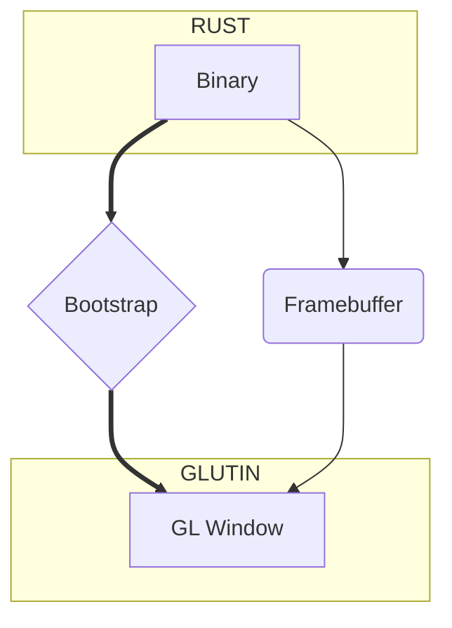

import useBaseUrl from '@docusaurus/useBaseUrl'

:::warning
This pattern is not available for now.
:::

import Rater from '@theme/Rater'

<div className="row">
  <div className="col col--4">
    <table>
      <tr>
        <td>Ease of Use</td>
        <td><Rater value="0"/></td>
      </tr>
      <tr>
        <td>Extensibility</td>
        <td><Rater value="0"/></td>
      </tr>
      <tr>
        <td>Performance</td>
        <td><Rater value="5"/></td>
      </tr>
      <tr>
        <td>Sicurezza</td>
        <td><Rater value="0"/></td>
      </tr>
    </table>
  </div>
  <div className="col col--4 pattern-logo">
    
  </div>
  <div className="col col--4">
    Pros:
    <ul>
      <li>Framebuffer FTW</li>
      <li>Window events rigged</li>
    </ul>
    Cons:
    <ul>
      <li>Broken on your machine</li>
    </ul>
  </div>
</div>

## Description

The GLUI is a research pattern that we will use internally to test approaches using a GLUTIN window. We’re not sure yet if it will make the final cut as a bona fide alternative to WebView, although early tests with transparent and multiwindow are exciting.

## Diagram



## Configurazione

Here's what you need to add to your tauri.conf.json file:

```json
"tauri": {
  "allowlist": {                  // all API endpoints are default false
    "all": false,                 // disable the api
  },
  "window": {                     // not yet normative
    "glutin": true,
    "webview": false
  }
}
```
