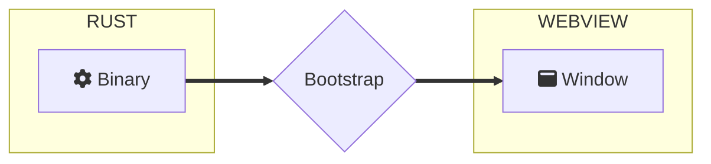

import Rater from '@theme/Rater'
import useBaseUrl from '@docusaurus/useBaseUrl'

<div className="row">
  <div className="col col--4">
    <table>
      <tr>
        <td>Ease of Use</td>
        <td><Rater value="5"/></td>
      </tr>
      <tr>
        <td>Extensibility</td>
        <td><Rater value="0"/></td>
      </tr>
      <tr>
        <td>Performance</td>
        <td><Rater value="5"/></td>
      </tr>
      <tr>
        <td>Sicurezza</td>
        <td><Rater value="5"/></td>
      </tr>
    </table>
  </div>
  <div className="col col--4 pattern-logo">
    
  </div>
    <div className="col col--4">
    Pros:
    <ul>
      <li>Quick to make</li>
      <li>Smallest size</li>
    </ul>
    Cons:
    <ul>
      <li>No remote resources</li>
      <li>No access to API</li>
    </ul>
  </div>
</div>

## Description

The Hermit recipe is a pattern for ultimate application isolation where all logic is self-contained in the Window and the binary exists merely to bootstrap the Window. There is no communication back to Rust from the Window, there is no localhost server, and the Window has no access to any remote resources. The Hermit is great for interactive Kiosk Mode and standalone HTML-based games.

## Diagram



## Configurazione

Here's what you need to add to your tauri.conf.json file:

```json
"tauri": {
  "allowlist": {
    "all": false,       // disable and tree-shake all api functions
  }
}
```
