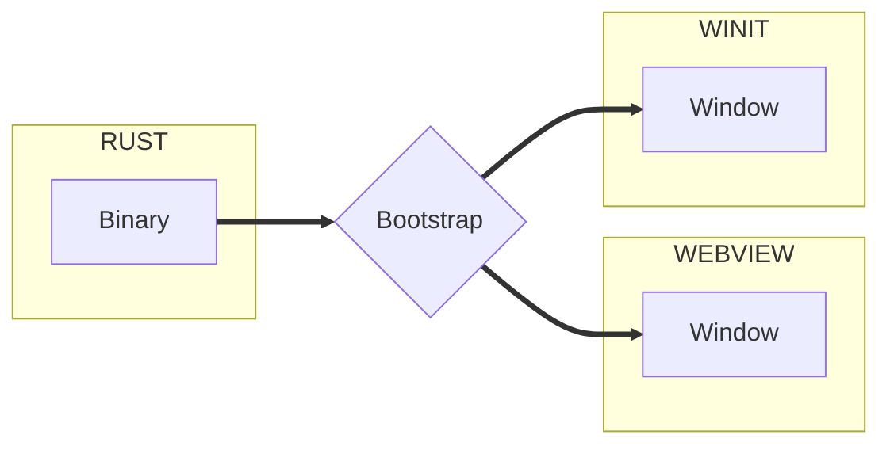

import useBaseUrl from '@docusaurus/useBaseUrl'
import Rater from '@theme/Rater'

<div className="row">
  <div className="col col--4">
    <table>
      <tr>
        <td>Ease of Use</td>
        <td><Rater value="4"/></td>
      </tr>
      <tr>
        <td>Extensibility</td>
        <td><Rater value="4"/></td>
      </tr>
      <tr>
        <td>Performance</td>
        <td><Rater value="3"/></td>
      </tr>
      <tr>
        <td>Sicurezza</td>
        <td><Rater value="5"/></td>
      </tr>
    </table>
  </div>
  <div className="col col--4 pattern-logo">
    
  </div>
  <div className="col col--4">
    Pros:
    <ul>
      <li>Windows can be spawned or destroyed at runtime</li>
      <li>Separation of concerns</li>
    </ul>
    Cons:
    <ul>
      <li>Somewhat complex</li>
    </ul>
  </div>
</div>

## Description

The Multiwin recipe will allow you to have multiple windows.

## Diagram



## Configurazione

Here's what you need to add to your tauri.conf.json file:

```json
"tauri": {
  "allowlist": {},                  // all API endpoints are default false
  "windows": [{
    "title": "Window1",
    "label": "main",
  }, {
    "title": "Splash",
    "label": "splashscreen"
  }]
}

```
