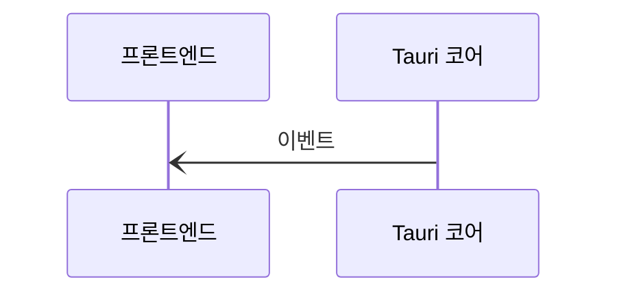
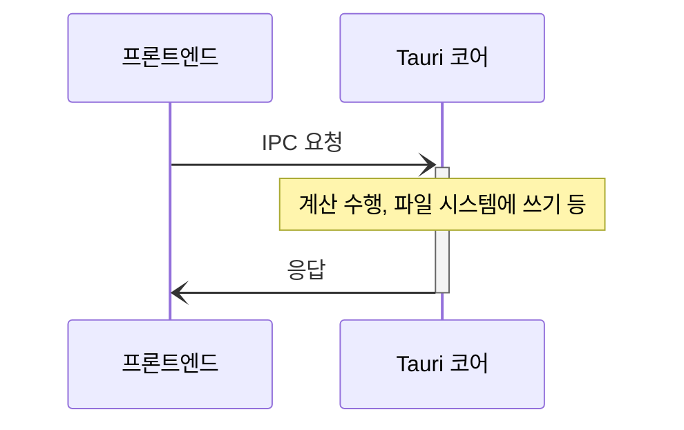

# 프로세스 간 통신

프로세스 간 통신 (IPC)는 격리된 프로세스가 안전히 통신하도록 하며, 이는 복잡한 앱을 만드는 것에서의 핵심이라고 할 수 있습니다.

Tauri에서는 [비동기 메시지 전송][]이라 불리는 특정한 종류의 프로세스 간 통신을 사용하고, _요청_ 과 _응답_ 이 간단한 데이터 표현으로 직렬화되어 프로세스 사이를 오갑니다. 인터넷에서 클라이언트와 서버 간 통신에 사용되는 패러다임이기에 웹 개발 경험을 갖고 있다면 메시지 전송이라는 말이 친숙할 수 있습니다.

메시지 전송은 받는 이가 올바르지 않은 요청을 거절하거나 무시할 수 있기에 공유 메모리나 직접 함수 접근보다 안전한 기술입니다. 예를 들어, Tauri 코어 프로세스가 요청이 악의적이라 판단하면, 단순히 요청을 무시하고 해당하는 함수를 절대 실행하지 않을 수 있습니다.

다음으로, Tauri에서 쓰는 두 가지 IPC 기초 요소를 자세히 설명하고자 합니다. 바로 `이벤트`와 `명령`입니다.

## 이벤트

이벤트는 생애 주기 이벤트나 상태 변화 소통 등에 잘 맞는, 보내면 끝인 단방향 IPC 메시지입니다. [명령](#commands)과 달리, 이벤트는 프론트엔드 _그리고_ Tauri 코어 양측에서 모두 보낼 수 있습니다.

<figure>

<figcaption>그림 1-2: 코어에서 프론트엔드로 보내진 이벤트</figcaption>
</figure>

## 명령

또, [외부 함수 인터페이스][]와 비슷한 추상화가 IPC 메시지 위애도 제공됩니다.[^1] 주된 API, `invoke`는 브라우저에서 `fetch` API를 사용하는 것과 비슷하며, 프론트엔드에서 Rust 함수에 인수를 전달해 호출하고 반환값을 받을 수 있습니다.

이 방식이 요청과 응답의 직렬화를 위해 [JSON-RPC][]와 비슷한 통신 규약을 내부적으로 사용하기에, 모든 인수와 반환값은 JSON 직렬화가 가능해야 합니다.

<figure>

<figcaption>그림 1-3: 명령 호출과 연관된 IPC 메시지</figcaption>
</figure>

<!-- prettier-ignore -->
[^1]: Because Commands still use message passing under the hood, they do not share the same security pitfalls as real FFI interfaces do.

[비동기 메시지 전송]: https://en.wikipedia.org/wiki/Message_passing#Asynchronous_message_passing
[JSON-RPC]: https://www.jsonrpc.org
[외부 함수 인터페이스]: https://en.wikipedia.org/wiki/Foreign_function_interface
