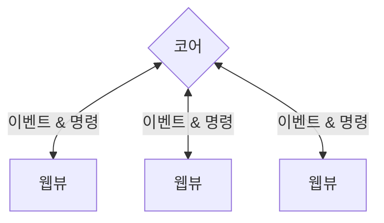

# 프로세스 모델

Tauri는 Electron이나 최신 웹 브라우저와 비슷한 다중 프로세스 구조를 사용합니다. 이 안내서는 그러한 설계를 선택한 이유와 왜 이것이 안전한 앱 작성의 핵심인지 알아봅니다.

## 왜 다중 프로세스일까요?

초창기 GUI 앱은 단일 프로세스를 사용해 연산을 수행하거나 화면을 그리고, 사용자 입력에 반응하는 것이 일반적이었습니다. 짐작하셨겠지만, 오래 실행되는 비싼 연산으로 인해 사용자 인터페이스가 응답하지 않거나, 더 심하게는 하나의 구성 요소에서 오류가 발생하여 앱 전체가 망가질 수 있다는 것입니다.

보다 내구성 있는 구조가 필요해졌고, 이에 여러 구성 요소를 여러 프로세스에서 실행하기 시작했습니다. 이는 현대의 멀티 코어 CPU 활용을 개선하고, 더 안전한 앱을 만들 수 있게 했습니다. 하나의 구성 요소에서 발생한 문제는 구성 요소가 다른 프로세스에 격리되어 있으므로 더이상 전체 시스템에 영향을 주지 않습니다. 프로세스가 잘못된 상태에 빠지면, 아주 쉽게 재시작하면 됩니다.

각 프로세스에 권한을 작업에 필요한 것만 갖도록 최소한으로 부여해 잠재적 취약점의 공격 범위를 제한할 수도 있습니다. 이러한 방식은 [최소 권한의 원칙][]이라고 알려져 있으며, 현실 세계에서도 보실 수 있습니다. 정원사가 정원을 다듬으러 올 때, 정원 열쇠만 주면 됩니다. 집 열쇠는 주지 **않을 겁니다**. 정원사가 그런 걸 필요로 하겠어요? 컴퓨터 프로그램에도 같은 개념을 적용시킬 수 있습니다. 접근 권한이 적으면 적을수록, 공격당했을 때 더 적은 피해를 갖습니다.

## 코어 프로세스

각 Tauri 앱은 앱의 진입점처럼 기능하고 운영 체제 전체에 대한 접근 권한을 갖는 유일한 구성 요소인 코어 프로세스를 가집니다.

코어의 주된 책임은 그 접근 권한을 사용해 응용 프로그램 창, 시스템 트레이 메뉴, 알림을 만들고 조율하는 것입니다. Tauri는 이를 쉽게 만들기 위해 필요한 교차 플랫폼 추상화를 구현합니다. 또한, 모든 [프로세스 간 통신][]을 코어 프로세스를 거쳐 전달합니다. 그래서 IPC 메시지를 하나의 중심부에서 가로채거나, 조건에 따라 거르거나, 조작할 수 있습니다.

코어 프로세스는 설정이나 데이터베이스 연결 등 전역 상태를 관리하는 책임도 갖습니다. 이것이 당신에게 창 사이의 상태 동기화를 쉽게 만들고, 프론트엔드에서 업무상 민감한 정보를 캐내려는 시선으로부터 보호합니다.

Tauri의 구현에 Rust를 선택한 것은 Rust의 [소유권(Ownership)][]이 훌륭한 성능을 유지하면서도 메모리 안전성을 보장하기 때문입니다.

<figure>

<figcaption>그림 1-1: Tauri 프로세스 모델의 단순화된 표현. 하나의 코어 프로세스가 하나 이상의 웹뷰 프로세스를 관리.</figcaption>
</figure>

## 웹뷰 프로세스

코어 프로세스는 그 자체로는 실질적인 사용자 인터페이스 (UI)를 그리지 않습니다. 대신 운영 체제가 제공하는 웹뷰 라이브러리를 이용하는 웹뷰 프로세스를 돌립니다. 웹뷰는 HTML, CSS, JavaScript를 실행하는 브라우저와 비슷한 환경입니다.

즉, Tauri 앱을 만들 때 대부분의 전통적인 웹 기반 기술 및 도구를 사용할 수 있습니다. 예를 들어, 수많은 Tauri 예시가 [Svelte][] 프론트엔드 프레임워크와 [Vite][] 번들러를 사용해 쓰였습니다.

보안 모범 사례 역시 마찬가지로 적용됩니다. 예를 들어, 사용자 입력은 언제나 소독해야 하고, 절대 프론트엔드에서 비밀 값을 다루어서는 안되며, 중요한 로직은 코어 프로세스에 맡기는 것이 공격 대상 지점을 최대한 작게 유지하는 방법입니다.

다른 유사한 솔루션과 달리 WebView 라이브러리는 최종 실행 파일에 포함되지 **않지만** 런타임에 동적으로 연결됩니다[^1]. 이로 인해 앱이 _꽤나_ 작아지지만, 전통적인 웹 개발에서처럼 플랫폼 간 차이점을 염두해두어야 합니다.

<!-- prettier-ignore -->
[^1]: 현재, Tauri는 Windows에서 [Microsoft Edge WebView2][]를, macOS에서 [WKWebView][]를, 그리고 Linux에서 [webkitgtk][]를 사용하고 있습니다.

[최소 권한의 원칙]: https://en.wikipedia.org/wiki/Principle_of_least_privilege
[프로세스 간 통신]: ./inter-process-communication/readme.md
[소유권(Ownership)]: https://doc.rust-lang.org/book/ch04-01-what-is-ownership.html
[Microsoft Edge WebView2]: https://docs.microsoft.com/en-us/microsoft-edge/webview2/
[WKWebView]: https://developer.apple.com/documentation/webkit/wkwebview
[webkitgtk]: https://webkitgtk.org
[Svelte]: https://svelte.dev/
[Vite]: https://vitejs.dev/
