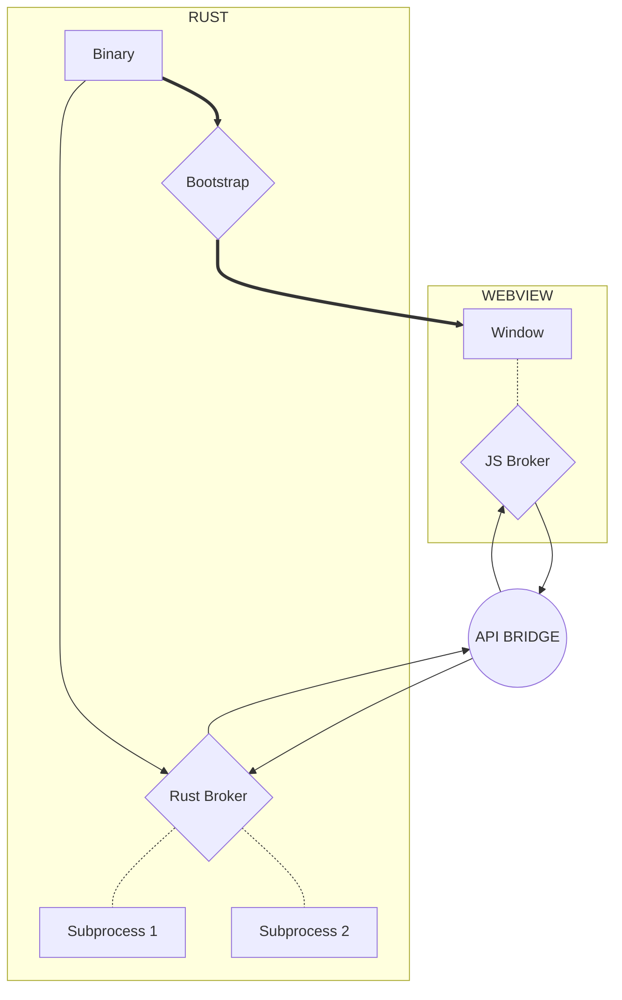

import Rater from '@theme/Rater'
import useBaseUrl from '@docusaurus/useBaseUrl'

<div className="row">
  <div className="col col--4">
    <table>
      <tr>
        <td>쉬운 사용</td>
        <td><Rater value="3"/></td>
      </tr>
      <tr>
        <td>확장성</td>
        <td><Rater value="5"/></td>
      </tr>
      <tr>
        <td>성능</td>
        <td><Rater value="4"/></td>
      </tr>
      <tr>
        <td>보안</td>
        <td><Rater value="4"/></td>
      </tr>
    </table>
  </div>
  <div className="col col--4 pattern-logo">
    
  </div>
    <div className="col col--4">
    장점
    <ul>
      <li>자유롭게 구성 가능</li>
      <li>Rust 기술 불필요</li>
    </ul>
    단점
    <ul>
      <li>몇몇 웹 API 사용 불가</li>
      <li>어려운 구현</li>
    </ul>
  </div>
</div>

## 설명

가교 레시피는 브로커끼리 메시지를 전달하는 안전 패턴으로, API를 사용해 암시적으로 가교를 건넙니다. 이는, 특정 범위로 기능을 제한하는 대신 메시지를 전달합니다.

## 도표



## 설정

tauri.conf.json 파일에 추가해야 할 내용입니다.

```json
{
  "tauri": {
    "allowlist": {
      "all": false,
      "clipboard": {
        "all": false,
        "readText": false,
        "writeText": false
      },
      "dialog": {
        "all": false,
        "ask": false,
        "confirm": false,
        "message": false,
        "open": false,
        "save": false
      },
      "fs": {
        "all": false,
        "copyFile": false,
        "createDir": false,
        "readDir": false,
        "readFile": false,
        "removeDir": false,
        "removeFile": false,
        "renameFile": false,
        "scope": [],
        "writeFile": false
      },
      "globalShortcut": {
        "all": false
      },
      "http": {
        "all": false,
        "request": false,
        "scope": []
      },
      "notification": {
        "all": false
      },
      "os": {
        "all": false
      },
      "path": {
        "all": false
      },
      "process": {
        "all": false,
        "exit": false,
        "relaunch": false,
        "relaunchDangerousAllowSymlinkMacos": false
      },
      "protocol": {
        "all": false,
        "asset": false,
        "assetScope": []
      },
      "shell": {
        "all": false,
        "execute": false,
        "open": false,
        "scope": [],
        "sidecar": false
      },
      "window": {
        "all": false,
        "center": false,
        "close": false,
        "create": false,
        "hide": false,
        "maximize": false,
        "minimize": false,
        "print": false,
        "requestUserAttention": false,
        "setAlwaysOnTop": false,
        "setDecorations": false,
        "setFocus": false,
        "setFullscreen": false,
        "setIcon": false,
        "setMaxSize": false,
        "setMinSize": false,
        "setPosition": false,
        "setResizable": false,
        "setSize": false,
        "setSkipTaskbar": false,
        "setTitle": false,
        "show": false,
        "startDragging": false,
        "unmaximize": false,
        "unminimize": false
      }
    }
  }
}
```
