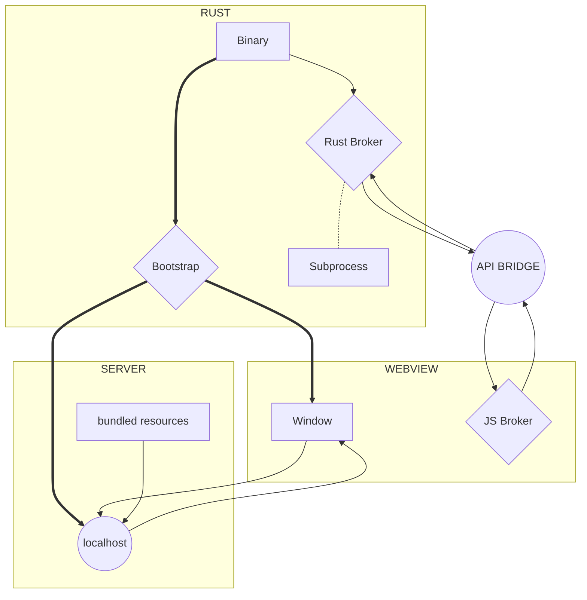

import Rater from '@theme/Rater'
import useBaseUrl from '@docusaurus/useBaseUrl'

<div className="row">
  <div className="col col--4">
    <table>
      <tr>
        <td>쉬운 사용</td>
        <td><Rater value="1"/></td>
      </tr>
      <tr>
        <td>확장성</td>
        <td><Rater value="5"/></td>
      </tr>
      <tr>
        <td>성능</td>
        <td><Rater value="3"/></td>
      </tr>
      <tr>
        <td>보안</td>
        <td><Rater value="2"/></td>
      </tr>
    </table>
  </div>
  <div className="col col--4 pattern-logo">
    
  </div>
    <div className="col col--4">
    장점
    <ul>
      <li>모든 기능 사용 가능</li>
      <li>Rust 기술 불필요</li>
    </ul>
    단점
    <ul>
      <li>가장 큰 번들 크기</li>
      <li>어려운 관심사 분리</li>
    </ul>
  </div>
</div>

## 설명

클라우드 가교 레시피는 로컬 호스트의 유연성과 가교의 보안성을 결합시켜 주는 것입니다. 기능들이 너무 많아 길을 잃기 쉽습니다.

## 도표



## 설정

tauri.conf.json 파일에 추가해야 할 내용입니다.

```json
"tauri": {
  "allowlist": {
    "all": true                   // 모든 API 활성화
  }
}
```
