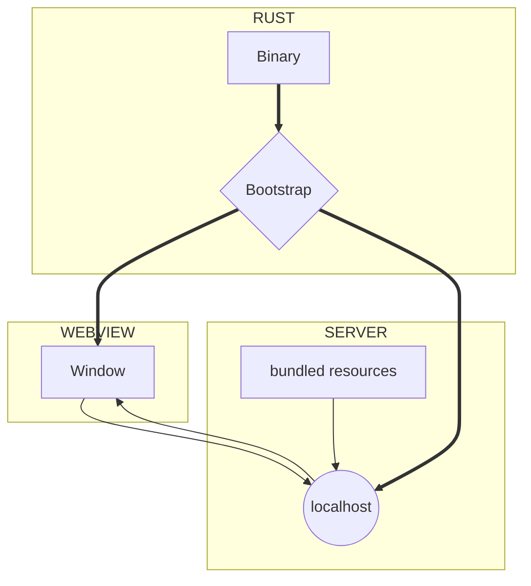

import Rater from '@theme/Rater'
import useBaseUrl from '@docusaurus/useBaseUrl'

<div className="row">
  <div className="col col--4">
    <table>
      <tr>
        <td>쉬운 사용</td>
        <td><Rater value="5"/></td>
      </tr>
      <tr>
        <td>확장성</td>
        <td><Rater value="3"/></td>
      </tr>
      <tr>
        <td>성능</td>
        <td><Rater value="3"/></td>
      </tr>
      <tr>
        <td>보안</td>
        <td><Rater value="2"/></td>
      </tr>
    </table>
  </div>
  <div className="col col--4 pattern-logo">
    
  </div>
    <div className="col col--4">
    장점
    <ul>
      <li>SPA 웹 앱과 비슷함</li>
      <li>Rust 기술 불필요</li>
    </ul>
    단점
    <ul>
      <li>Rust API 접근 불가</li>
      <li>localhost 서버 사용</li>
    </ul>
  </div>
</div>

## 설명

Cloudish 방법론은 유연성과 앱 성능을 극대화하기 위한 패턴입니다. 이것은 localhost 서버를 사용합니다. 즉, 앱이 기술적으로 다른 프로세스(예: 브라우저 및 네트워크 내에 다른 장치) 에서 사용할 수 있다는 의미 입니다. 모든 에셋은 바이너리로 만들어지겠지만 마치 별개의 파일인 것처럼 제공됩니다.

## 도표



## 설정

tauri.conf.json 파일에 추가해야 할 내용입니다.

```json
"tauri": {
  "allowlist": {
    "all": false                  // 모든 API 비활성화
  }
}

```
