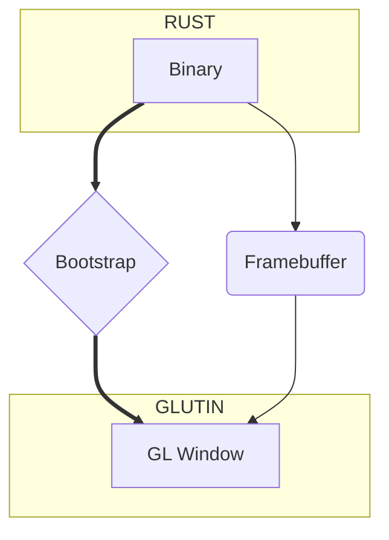

import useBaseUrl from '@docusaurus/useBaseUrl'

:::warning
아직 이 레시피는 사용할 수 없습니다.
:::

import Rater from '@theme/Rater'

<div className="row">
  <div className="col col--4">
    <table>
      <tr>
        <td>쉬운 사용</td>
        <td><Rater value="0"/></td>
      </tr>
      <tr>
        <td>확장성</td>
        <td><Rater value="0"/></td>
      </tr>
      <tr>
        <td>성능</td>
        <td><Rater value="5"/></td>
      </tr>
      <tr>
        <td>보안</td>
        <td><Rater value="0"/></td>
      </tr>
    </table>
  </div>
  <div className="col col--4 pattern-logo">
    
  </div>
  <div className="col col--4">
    장점
    <ul>
      <li>프레임버퍼 FTW</li>
      <li>창 이벤트를 조작함</li>
    </ul>
    단점
    <ul>
      <li>당신의 장비에 고장이 발생</li>
    </ul>
  </div>
</div>

## 설명

GLUI는 GLUTIN 창을 사용하여 접근 방식을 테스트하기 위해 내부적으로 사용할 실험적 패턴입니다. 투명하고 다중 창을 사용한 초기 테스트가 흥미롭긴 하지만 최종 컷이 웹뷰의 진정한 대안으로 나올지는 아직 확실하지 않습니다.

## 도표



## 설정

tauri.conf.json 파일에 추가해야 할 내용입니다.

```json
"tauri": {
  "allowlist": {                  // 모든 API 끝점의 기본값은 false 
    "all": false,                  // API 비활성화
  },
  "window": {                     // 아직 표준화되지 않음
    "glutin": true,
    "webview": false
  }
}
```
