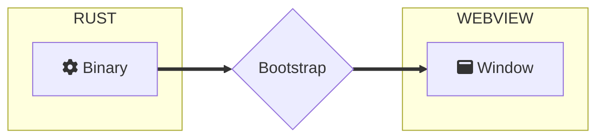

import Rater from '@theme/Rater'
import useBaseUrl from '@docusaurus/useBaseUrl'

<div className="row">
  <div className="col col--4">
    <table>
      <tr>
        <td>쉬운 사용</td>
        <td><Rater value="5"/></td>
      </tr>
      <tr>
        <td>확장성</td>
        <td><Rater value="0"/></td>
      </tr>
      <tr>
        <td>성능</td>
        <td><Rater value="5"/></td>
      </tr>
      <tr>
        <td>보안</td>
        <td><Rater value="5"/></td>
      </tr>
    </table>
  </div>
  <div className="col col--4 pattern-logo">
    
  </div>
    <div className="col col--4">
    장점
    <ul>
      <li>빠르게 만들 수 있음</li>
      <li>최소 크기</li>
    </ul>
    단점
    <ul>
      <li>원격 자원 없음</li>
      <li>API 접근 불가</li>
    </ul>
  </div>
</div>

## 설명

Hermit 방법론은 모든 로직이 창에 자체 포함되고 바이너리가 단지 창을 부트스트랩하기 위해 존재하는 궁극적인 애플리케이션 격리를 위한 패턴입니다. 창에서 Rust로 다시 통신할 수 없고 localhost 서버가 없으며 창은 원격 리소스에 액세스할 수 없습니다. Hermit은 대화형 키오스크 모드나 독립 실행형 HTML 기반 게임에 적합합니다.

## 도표



## 설정

tauri.conf.json 파일에 추가해야 할 내용입니다.

```json
"tauri": {
  "allowlist": {
    "all": false,       // 모든 API 함수를 비활성화해 쳐냅니다
  }
}
```
