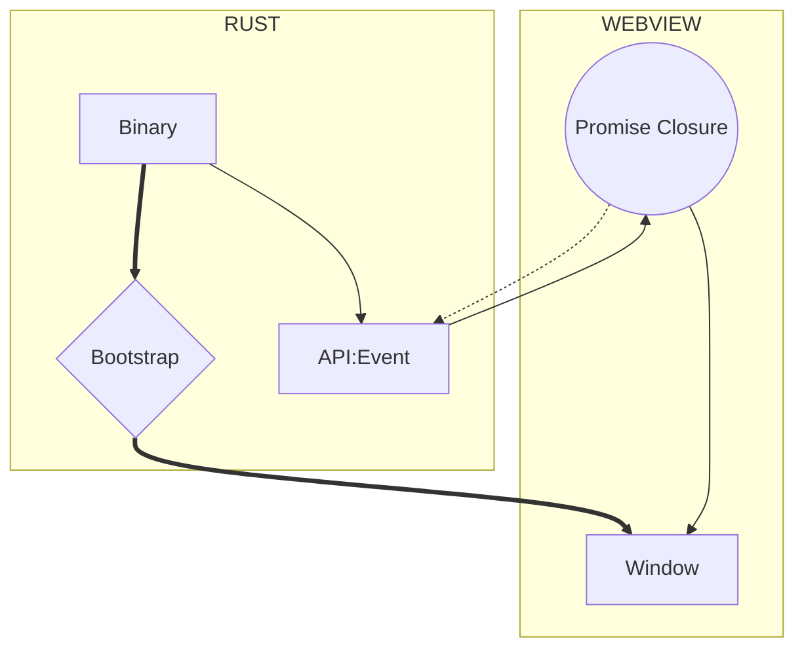

import Rater from '@theme/Rater'
import useBaseUrl from '@docusaurus/useBaseUrl'

<div className="row">
  <div className="col col--4">
    <table>
      <tr>
        <td>쉬운 사용</td>
        <td><Rater value="2"/></td>
      </tr>
      <tr>
        <td>확장성</td>
        <td><Rater value="4"/></td>
      </tr>
      <tr>
        <td>성능</td>
        <td><Rater value="5"/></td>
      </tr>
      <tr>
        <td>보안</td>
        <td><Rater value="5" /></td>
      </tr>
    </table>
  </div>
  <div className="col col--4 pattern-logo">
    
  </div>
  <div className="col col--4">
    장점
    <ul>
      <li>최고 보안 등급</li>
      <li>우아하고 강력함</li>
    </ul>
    단점
    <ul>
      <li>Rust 기술 필요</li>
      <li>원격 자원 없음</li>
    </ul>
  </div>
</div>

## 설명

폐쇄 레시피는 [가교 패턴](./bridge)을 최소로 사용하여, Rust가 JS 프로미스 클로저를 창에 주입하고 콜백의 일부로써 이를 만료시키는 것만 Rust와 응용 프로그램 창 사이 상호작용으로 허용합니다.

## 도표



## 설정

tauri.conf.json 파일에 추가해야 할 내용입니다.

```json
"tauri": {
  "allowlist": {}                  // 기본적으로 모든 API 종단점을 허용하지 않습니다
}
```
