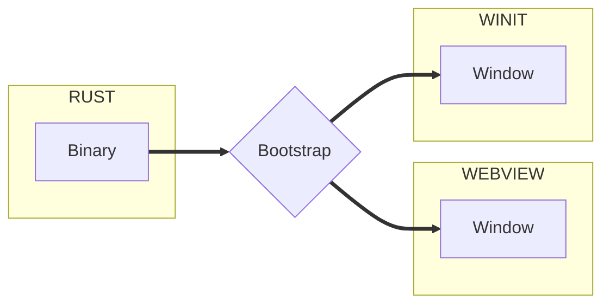

import useBaseUrl from '@docusaurus/useBaseUrl'
import Rater from '@theme/Rater'

<div className="row">
  <div className="col col--4">
    <table>
      <tr>
        <td>쉬운 사용</td>
        <td><Rater value="4"/></td>
      </tr>
      <tr>
        <td>확장성</td>
        <td><Rater value="4"/></td>
      </tr>
      <tr>
        <td>성능</td>
        <td><Rater value="3"/></td>
      </tr>
      <tr>
        <td>보안</td>
        <td><Rater value="5"/></td>
      </tr>
    </table>
  </div>
  <div className="col col--4 pattern-logo">
    
  </div>
  <div className="col col--4">
    장점
    <ul>
      <li>실행 도중 창을 만들거나 없앨 수 있음</li>
      <li>관심사 분리</li>
    </ul>
    단점
    <ul>
      <li>다소 복잡함</li>
    </ul>
  </div>
</div>

## 설명

다중 창 레시피는 여러 개의 창을 관리할 수 있게 합니다.

## 도표



## 설정

tauri.conf.json 파일에 추가해야 할 내용입니다.

```json
"tauri": {
  "allowlist": {},                  // 기본적으로 모든 API 종단점을 허용하지 않습니다
  "windows": [{
    "title": "Window1",
    "label": "main",
  }, {
    "title": "Splash",
    "label": "splashscreen"
  }]
}

```
