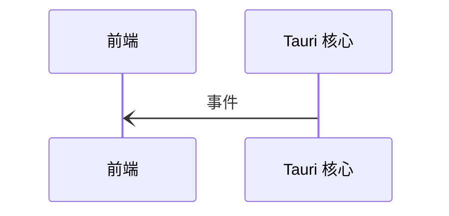
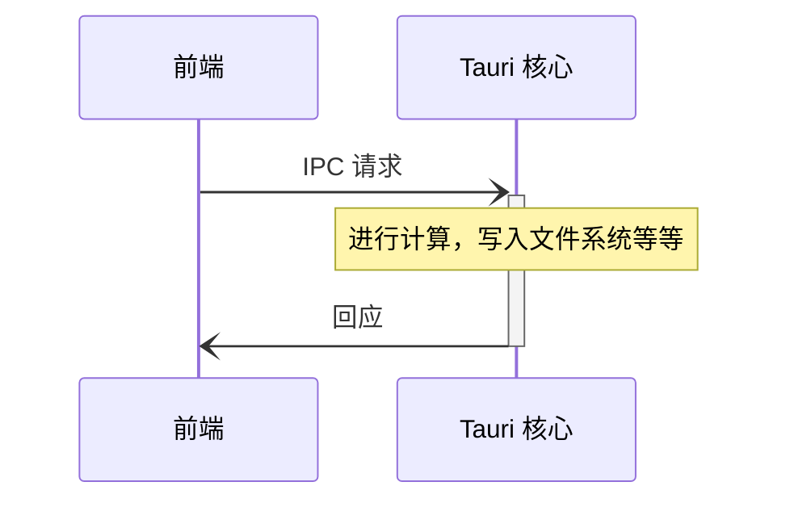

# 进程间通信

进程间通信 (IPC) 可以让多个独立进程安全地交流信息，更是构建复杂应用程序的关键。

Tauri 使用名为[异步信息传递][]的一种进程间通信技术。由此，进程可以通过简单的数据表达方式来交换序列化后的_请求_及_回应_信息。 数据传递一词对有着网页开发经验的用户想必比较耳熟，因为是互联网上常见的客户端 - 服务器交流模式。

由于数据传递允许接收方拒绝或丢弃请求，故其相比共享内存，或是直接函数访问而言更为安全。 举个例子，若 Tauri 核心进程觉得某个请求是恶意的，那么它可以丢弃此请求，而不执行所请求的函数。

下面，我们将详细为您陈述 Tauri 所使用的两种跨进程通信方式 - `事件`及`指令`。

## 事件

事件是即发即弃的单向进程间通信信息，非常适合用于交流生命周期事件及状态更改。 与[指令](#commands)相反，事件既可以由前端发送，_也可以由_ Tauri 核心发送。

<figure>

<figcaption>图例 1-2：由核心向前端发送的事件。</figcaption>
</figure>

## 指令

Tauri 同时提供一个[外部函数接口][]，类似基于跨进程通信信息的抽象的[^1]。 主要 API `invoke` 与浏览器中的 `fetch` API 类似，前端可以使用此 API 来调用 Rust 函数、传递参数和接收数据。

由于此机制底层使用类似 [JSON-RPC][] 的协议来序列化请求和回应，所有参数及返回数据均必须序列化为 JSON 格式。

<figure>

<figcaption>图例 1-3：涉及指令执行时的跨进程通信信息。</figcaption>
</figure>

<!-- prettier-ignore -->
[^1]: Because Commands still use message passing under the hood, they do not share the same security pitfalls as real FFI interfaces do.

[异步信息传递]: https://en.wikipedia.org/wiki/Message_passing#Asynchronous_message_passing
[JSON-RPC]: https://www.jsonrpc.org
[外部函数接口]: https://en.wikipedia.org/wiki/Foreign_function_interface
