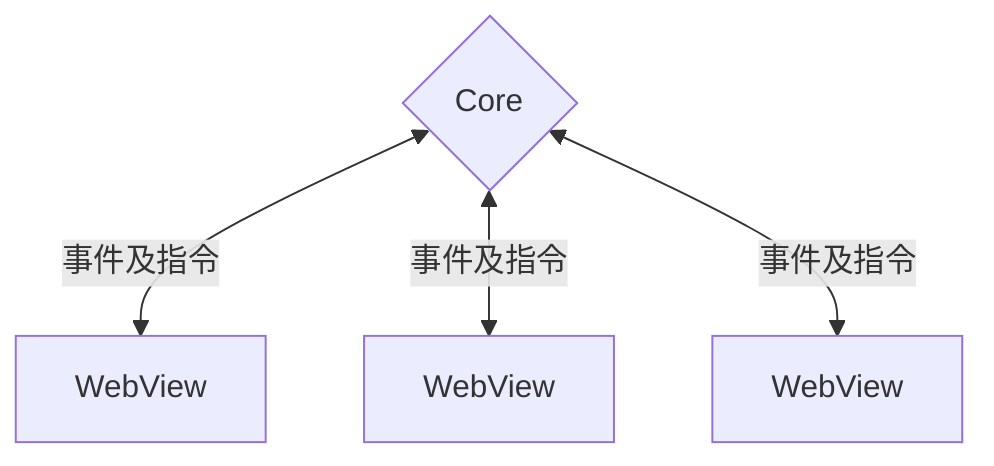

# 进程模型

Tauri 采用了一种类似 Electron 和大多数现代Web浏览器那样的多进程架构。 本指南探讨了这种设计选择背后的原因，以及为什么它是编写安全应用程序的关键。

## 为什么选择多进程？

在早期的 GUI 应用程序中，通常使用单个进程进行计算、绘制并对用户输入做出响应。 和你猜的一样，这意味着一个长期运行的昂贵计算会让用户界面失去响应。更糟糕的是，一个应用组件的故障会让整个应用程序崩溃。

很显然，需要有一个更具韧性的架构，因此应用程序开始在不同的进程中运行不同的组件。 这可以更好地利用现代多核 CPU，且创造出更安全的应用程序。 一个组件的崩溃不再影响整个系统，因为组件被隔离在不同的进程中。 如果应用中的某个进程崩溃了，我们可以很轻松的重启它

我们还可以通过只给每个进程分配足够完成工作的最低限度的权限，来限制潜在漏洞的破坏范围。 这种模式被称为[最小权限原则][]，你一直在现实世界中看到它。 如果有一个园丁要来为你修剪你的绿植，你只需要给他一把花园的钥匙。 而**不**会给他们你的房子的钥匙。他们为什么会需要它？ 同样的概念也适用于计算机程序。 我们给予他们的访问权限越少，当他们出现问题的时候，能造成的损害就越小。

## 主进程

每个 Tauri 应用程序都有一个核心进程，它作为应用程序的入口点，是唯一可以完整访问操作系统的组件。

核心进程的主要职责是使用访问权限来创建和管理应用程序窗口、系统托盘菜单或通知。 Tauri 实现了必要的跨平台抽象来简化该操作。 它还通过核心进程路由所有的[进程间通信][]，让您在一处就能拦截、过滤和操作 IPC 消息。

核心进程还应该负责管理全局状态，例如设置或数据库连接。 这使你能够轻松地在窗口间同步状态，并保护你的业务敏感数据免受来自前端的窥探。

We chose Rust to implement Tauri because of its concept of [Ownership][] guarantees memory safety while retaining excellent performance.

<figure>

<figcaption>图 1-1: Tauri 进程模型的简化表示。 单个核心进程管理一个或多个 WebView 进程。</figcaption>
</figure>

## WebView 进程

核心进程自身并不渲染实际的用户界面 (UI)，它会直接利用操作系统提供的 WebView 库来实现页面渲染。 WebView 是一个类似浏览器的环境，可以执行你的 HTML、CSS 和 JavaScript。

这意味着你在传统 Web 开发中使用的大多数技术和工具都可以用来创建 Tauri 应用程序。 例如，许多 Tauri 的例子是用 [Svelte][] 框架和 [Vite][] 编写的。

安全最佳实践也同样适用，例如，你必须总是校验并处理用户输入，永远不要在前端处理机密数据，并且理想情况下，将尽可能多的业务逻辑推迟到 Core 进程，以此来确保你的应用安全。

Unlike other similar solutions, the WebView libraries are **not** included in your final executable but dynamically linked at runtime[^1]. 这使得你的应用程序_明显_更小，但这也意味着你需要牢记平台的差异，就像传统的 Web 开发一样。

<!-- prettier-ignore -->
[^1]: 目前，Tauri 在 Windows 上使用 [Microsoft Edge WebView2][]，在 macOS 上使用 [WKWebView][]，在 Linux 上使用 [webkitgtk][]。

[最小权限原则]: https://en.wikipedia.org/wiki/Principle_of_least_privilege
[进程间通信]: ./inter-process-communication/readme.md
[Ownership]: https://doc.rust-lang.org/book/ch04-01-what-is-ownership.html
[Microsoft Edge WebView2]: https://docs.microsoft.com/en-us/microsoft-edge/webview2/
[WKWebView]: https://developer.apple.com/documentation/webkit/wkwebview
[webkitgtk]: https://webkitgtk.org
[Svelte]: https://svelte.dev/
[Vite]: https://vitejs.dev/
