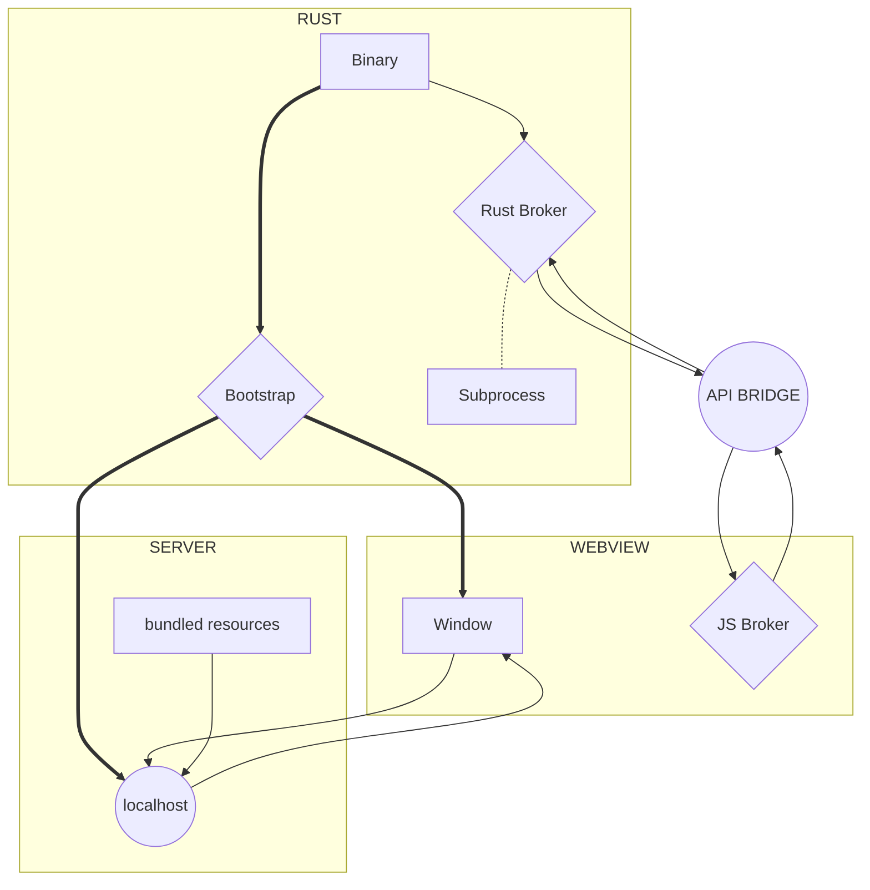

import Rater from '@theme/Rater'
import useBaseUrl from '@docusaurus/useBaseUrl'

<div className="row">
  <div className="col col--4">
    <table>
      <tr>
        <td>Ease of Use</td>
        <td><Rater value="1"/></td>
      </tr>
      <tr>
        <td>可扩展性</td>
        <td><Rater value="5"/></td>
      </tr>
      <tr>
        <td>性能</td>
        <td><Rater value="3"/></td>
      </tr>
      <tr>
        <td>安全</td>
        <td><Rater value="2"/></td>
      </tr>
    </table>
  </div>
  <div className="col col--4 pattern-logo">
    
  </div>
    <div className="col col--4">
    Pros:
    <ul>
      <li>所有可用功能</li>
      <li>无需 Rust 技能</li>
    </ul>
    Cons:
    <ul>
      <li>Largest bundle size</li>
      <li>Hard to separate concerns</li>
    </ul>
  </div>
</div>

## 描述

The Cloudbridge recipe combines the flexibility of a localhost and the security of the bridge. 有这么多的功能，它可能很容易丢失。

## Diagram



## 配置

这里是您需要添加到 tauri.conf.json 文件中的内容：

```json
"tauri": {
  "allowlist": {
    "all": true                   // 启用整个 API
  }
}
```
