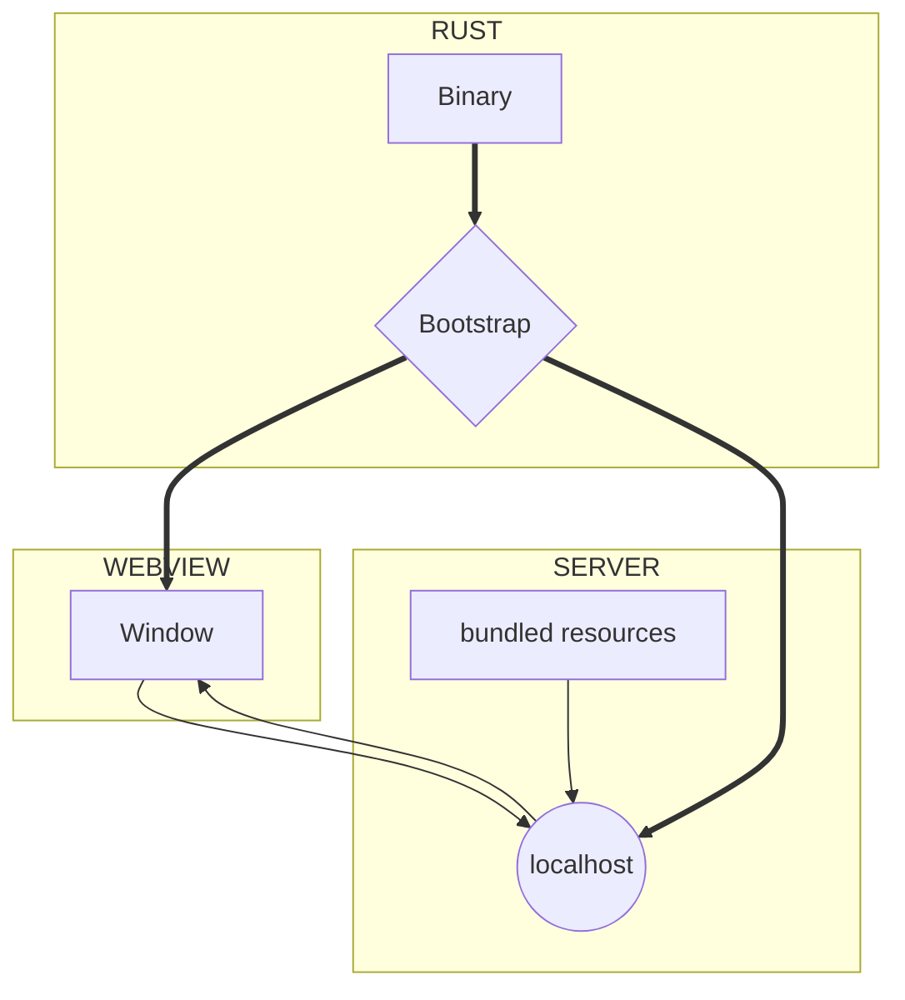

import Rater from '@theme/Rater'
import useBaseUrl from '@docusaurus/useBaseUrl'

<div className="row">
  <div className="col col--4">
    <table>
      <tr>
        <td>Ease of Use</td>
        <td><Rater value="5"/></td>
      </tr>
      <tr>
        <td>可扩展性</td>
        <td><Rater value="3"/></td>
      </tr>
      <tr>
        <td>性能</td>
        <td><Rater value="3"/></td>
      </tr>
      <tr>
        <td>安全</td>
        <td><Rater value="2"/></td>
      </tr>
    </table>
  </div>
  <div className="col col--4 pattern-logo">
    
  </div>
    <div className="col col--4">
    Pros:
    <ul>
      <li>类似于单页面应用</li>
      <li>无需 Rust 技能</li>
    </ul>
    Cons:
    <ul>
      <li>无法访问Rust API</li>
      <li>Uses a localhost server</li>
    </ul>
  </div>
</div>

## 描述

The Cloudish recipe is a pattern for maximum flexibility and app performance. It uses a localhost server, which means that your app will technically be available to other processes, like browsers and potentially other devices on the network. All of your assets are baked into the binary but served as if they were distinct files.

## Diagram



## 配置

这里是您需要添加到 tauri.conf.json 文件中的内容：

```json
"tauri": {
  "allowlist": {
    "all": false                  // disable entire API
  }
}

```
