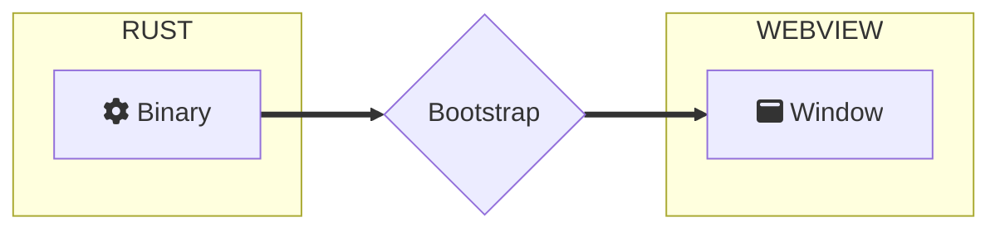

import Rater from '@theme/Rater'
import useBaseUrl from '@docusaurus/useBaseUrl'

<div className="row">
  <div className="col col--4">
    <table>
      <tr>
        <td>Ease of Use</td>
        <td><Rater value="5"/></td>
      </tr>
      <tr>
        <td>可扩展性</td>
        <td><Rater value="0"/></td>
      </tr>
      <tr>
        <td>性能</td>
        <td><Rater value="5"/></td>
      </tr>
      <tr>
        <td>安全</td>
        <td><Rater value="5"/></td>
      </tr>
    </table>
  </div>
  <div className="col col--4 pattern-logo">
    
  </div>
    <div className="col col--4">
    Pros:
    <ul>
      <li>快速创建</li>
      <li>最小尺寸</li>
    </ul>
    Cons:
    <ul>
      <li>没有远程资源</li>
      <li>无法访问 API</li>
    </ul>
  </div>
</div>

## 描述

The Hermit recipe is a pattern for ultimate application isolation where all logic is self-contained in the Window and the binary exists merely to bootstrap the Window. 在这一模式下，窗口与 Rust 后端没有通信，没有本地服务，窗口也不能访问任何远程资源。 The Hermit is great for interactive Kiosk Mode and standalone HTML-based games.

## Diagram



## 配置

这里是您需要添加到 tauri.conf.json 文件中的内容：

```json
"tauri": {
  "allowlist": {
    "all": false,       // 禁用以及移除所有 API 函数
  }
}
```
