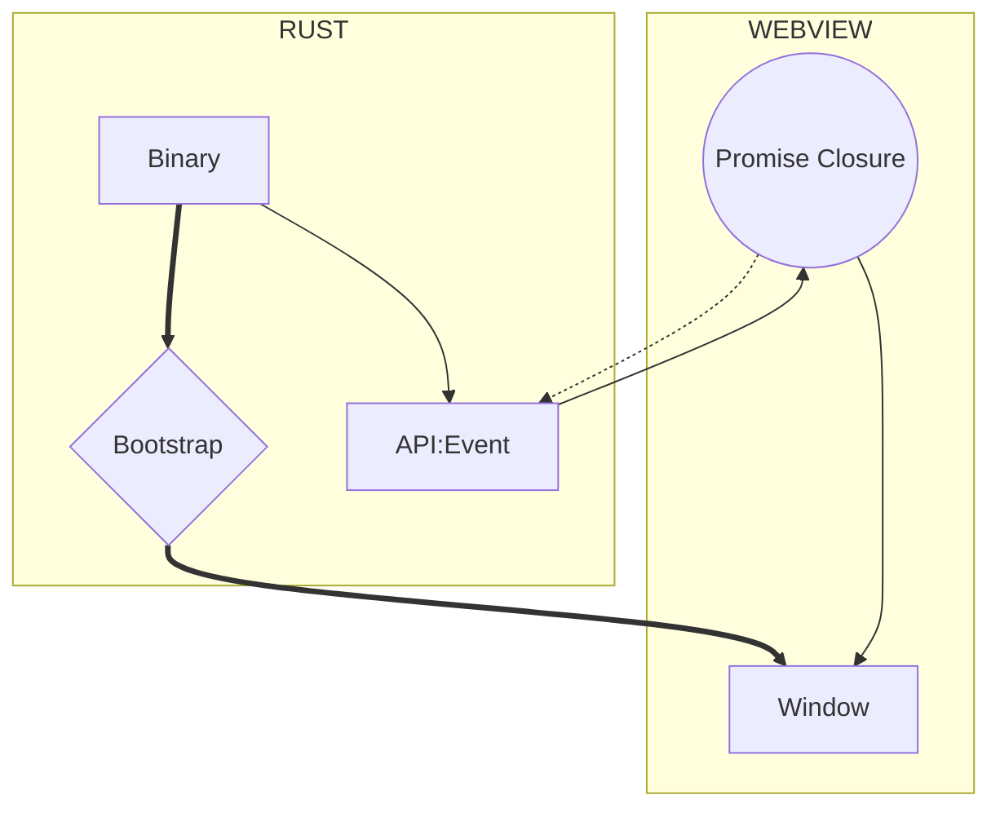

import Rater from '@theme/Rater'
import useBaseUrl from '@docusaurus/useBaseUrl'

<div className="row">
  <div className="col col--4">
    <table>
      <tr>
        <td>Ease of Use</td>
        <td><Rater value="2"/></td>
      </tr>
      <tr>
        <td>可扩展性</td>
        <td><Rater value="4"/></td>
      </tr>
      <tr>
        <td>性能</td>
        <td><Rater value="5"/></td>
      </tr>
      <tr>
        <td>安全</td>
        <td><Rater value="5" /></td>
      </tr>
    </table>
  </div>
  <div className="col col--4 pattern-logo">
    
  </div>
  <div className="col col--4">
    Pros:
    <ul>
      <li>最高安全等级</li>
      <li>优雅而强大的</li>
    </ul>
    Cons:
    <ul>
      <li>需要 Rust 技能</li>
      <li>没有远程资源</li>
    </ul>
  </div>
</div>

## 描述

The Lockdown recipe is a minimal usage of the [Bridge pattern](./bridge), which only allows interaction between Rust and the Window via expiring JS Promise Closures that are injected into the Window by Rust and nulled as part of the callback.

## Diagram



## 配置

这里是您需要添加到 tauri.conf.json 文件中的内容：

```json
"tauri": {
  "allowlist": {}                  // 所有 API 默认禁止
}
```
