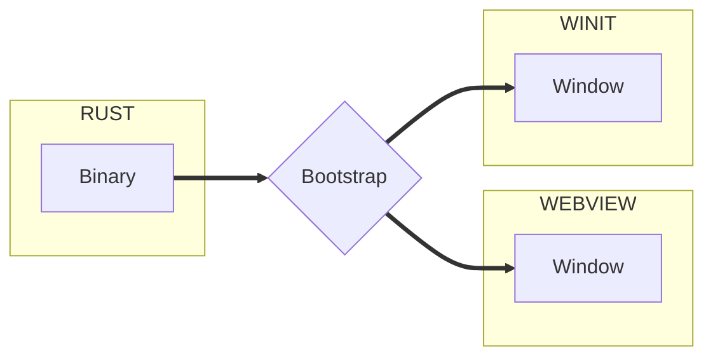

import useBaseUrl from '@docusaurus/useBaseUrl'
import Rater from '@theme/Rater'

<div className="row">
  <div className="col col--4">
    <table>
      <tr>
        <td>Ease of Use</td>
        <td><Rater value="4"/></td>
      </tr>
      <tr>
        <td>可扩展性</td>
        <td><Rater value="4"/></td>
      </tr>
      <tr>
        <td>性能</td>
        <td><Rater value="3"/></td>
      </tr>
      <tr>
        <td>安全</td>
        <td><Rater value="5"/></td>
      </tr>
    </table>
  </div>
  <div className="col col--4 pattern-logo">
    
  </div>
  <div className="col col--4">
    Pros:
    <ul>
      <li>程序运行时可以创建或关闭窗口</li>
      <li>关注分离</li>
    </ul>
    Cons:
    <ul>
      <li>有些复杂</li>
    </ul>
  </div>
</div>

## 描述

多窗口配方可让您创建多个窗口。

## Diagram



## 配置

这里是您需要添加到 tauri.conf.json 文件中的内容：

```json
"tauri":
  "allowlist": {}, // 所有 API 端点默认为 false
  "windows": [
    "title": "窗口 1",
    "label": "main",
  },
    "title": "启动页",
    "label": "splashscreen"
  }]
}

```
