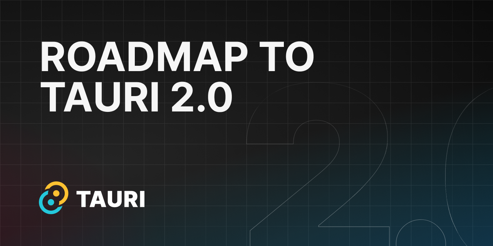

Tauri 1.0 was [released in June 2022](/blog/tauri-1-0/) and introduced an app toolkit for developers to build apps using HTML, CSS, and JavaScript with the security and performance of Rust. Tauri has been pivotal in redefining and asking the question: "What is an app?"

Version 1.0 launched with support for Linux, macOS, and Windows and has been updated with new features, DX improvements, and bug fixes to bring us to [Tauri 1.4](/blog/tauri-1-4/) that is available now.

But there's one question the Tauri Working Group gets asked time and time again. We affectionately refer to it as "Mobile when?!?" and today we'd like to outline the path ahead of us to get to Tauri 2.0 and to answer that question.

## What is Tauri 2.0?

In essence, the 2.0 release of Tauri is The Mobile Update. But 2.0 is so much more than just mobile. Here are a few of the features that will be included:

- **Powerful Plugins**: Many of the Tauri APIs have been shifted to use the Tauri plugin system. This allows us to make Tauri code more modular, more maintainable, but also enables us to make the plugin system more powerful for developers to build their own plugins.
- **Swift and Kotlin Bindings for Plugins**: Now you can write platform-specific code in Swift and Kotlin. Tauri has offered a bridge between Rust and JavaScript code since version 1.0. With Tauri 2.0, plugin developers will be able to write code in Swift and Kotlin to integrate more closely with the systems they're developing for.
- **Support for iOS and Android**: You'll be able to build Tauri apps and run them on iOS and Android.

<!-- TODO: Did I phrase all of the above correctly? Anything else that we want added in? -->

We've already seen developers doing amazing things with the prerelease version of Tauri 2.0 and we're excited to move forward to a stable version to get it in the hands of everyone.

## Path to Tauri 2.0 Stable

Right now, we are in the 2.0 alpha phase. Here are the 3 key milestones to get us to Tauri 2.0 stable:

1. [Beta](#beta)
2. [Release Candidate](#release-candidate)
3. [Stable](#stable)

Below are the steps within each of those milestones that the Tauri Working Group are driving towards.

### Beta

To enter a beta phase Tauri 2.0 must be feature-complete and working with no known major issues. This means that the Tauri Working Group are satisfied with the public Tauri APIs and don't anticipate any breaking changes (although they are possible as we receive community feedback).

Once we've entered beta then we will lock down the code base and move onto an auditing phase. No new features will be targeted for Tauri 2.0 after this point.

Security is very important to Tauri. We work with external auditors to review Tauri code so that it can be as secure as possible for Tauri developers and their users. A similar approach was taken with Tauri 1.0 in collaboration with Radically Open Security ([Tauri 1.0 Security Audit Report](https://github.com/tauri-apps/tauri/blob/dev/audits/Radically_Open_Security-v1-report.pdf)).

More details on the security audit for 2.0 are to come in the future.

### Release Candidate

Once all of the audit findings are resolved then we will move on to the release candidate phase. This is where we'll ask the Tauri community to give it a test drive, see if there are any bugs, and to provide feedback in preparation for the stable release.

The RC phase will be time-locked so that early adopters can help us discover pain points and low-hanging fruit that can be resolved quickly. This will also include a documentation sprint in order to align what we know with what we show. More details on this will be shared as we get get closer to the release candidate phase.

### Stable

Tauri 2.0 will be released and generally available for everyone to build amazing things with. We will also continue fixing bugs and releasing updates in line with our current approach of publishing patches and minor updates.

### Where We Are

There are a lot of moving parts in moving towards a stable release. The two main parts are the findings and fixes from the security audit alongside the feedback and adjustments from the community. These two pieces are incredibly important and we want to be sure we can prioritize those without sacrificing the security and quality of Tauri.

Because of those priorities we don't yet have hard timelines for a Tauri 2.0 stable release. We have internal targets that we're aiming for to keep us on track, but we want to be sure that we're flexible to accommodate feedback.

What we can share right now is that we're roughly targeting the stable release of Tauri 2.0 in early 2024. We're driving sharply ahead to enter the beta phase as soon as possible.

As we make progress towards Tauri 2.0 we'll be sure to share updates to the community. The primary way to keep up to date is to watch for the Tauri releases as they move through the beta, release candidate, and lastly stable phases. You can also keep an eye on [Twitter](https://twitter.com/TauriApps), [Mastodon](https://fosstodon.org/@TauriApps), and [Discord](https://discord.com/invite/tauri).

## Getting Involved

While we're working towards Tauri 2.0 stable there are a lot of ways for the community to get involved. The more involvement and feedback we have, the better Tauri 2.0 will be for everyone. Here are just a few ways to get involved:

- Test prerelease versions of Tauri and give feedback via Discord and GitHub issues.
- Contribute to documentation and translations on https://v2.tauri.app.
- Help in the Tauri community by supporting others in Discord and GitHub issues and giving feedback for major issues that arise.
- Begin planning content around Tauri 2.0 (although we recommend waiting until at least 2.0 beta). Reach out to the Tauri Working Group on Discord if you would like to collaborate on content ideas such as videos, blogs, courses, or anything else.

---

We hope this provides a bit of transparency about where we're at, where we're headed, and what you can do to help us get there. Give us your feedback by [joining us on Discord](https://discord.com/invite/tauri) and [joining the GitHub Discussion for this post](https://github.com/tauri-apps/tauri-docs/discussions/1522). Happy building!
