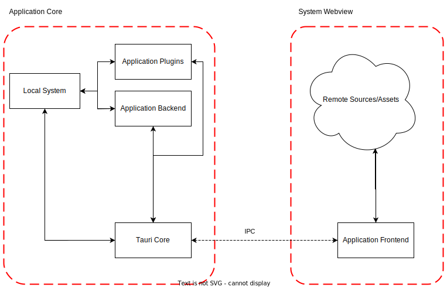

This page seeks to explain the high-level concepts and security features
at the core of Tauri's design and ecosystem that make you, your apps, and your users safer by default.

It also contains advice for best practices, how to disclose vulnerabilities to us
and basic threat modeling.

:::note

It is important to remember that the security of your Tauri application is the sum of the overall security
of Tauri itself, all Rust and npm dependencies, your code, and the devices that run the final application.
The Tauri Team does their best to do their part,
the security community does its part, and you too should follow a few important best practices.

:::

## Security Boundaries

Tauri's security model differentiates between rust code written for the application's
core and frontend code written in any framework or language understood by the system
WebView.

The IPC layer is the bridge for communication between these two trust groups and ensures
that boundaries are not broken.




Any code executed by the plugins or the application core has full
access to all system resources and is not constrained.

Any code executed in the WebView has only access to system resources
via the well defined IPC layer. The access of application core commands is configured
and constrained via the [capabilities](#capabilities) defined in the application configuration.
The individual command implementations enforce the optional fine grained access level,
which are also defined in the capabilities configuration.

## Frontend Hardening

Tauri allows developers to choose their own frontend stack and framework.
This means we can not provide you with a hardening guide for every frontend stack
of choice, but Tauri offers generic features to control and contain attack surface.

### Capabilities

Tauri provides application and plugin developers with a capabilities system,
to granually enable and constrain the core exposure to the application frontend running in the
system WebView.

Capabilities are a group of [permissions](#permissions) mapped to application windows by window label,
where permissions are descriptions of explicit privileges or enablement of commands.
Permission define the [scope](#scopes) of commands, which is used for granular access controls.

This can be configured in the `capabilities` section of the Tauri configuration.
For a full reference of the configuration scheme please see the `references` section.

*What does it protect against?*

Depending on the permissions and capabilities it is able to:

- Minimize impact of frontend compromise
- Prevent or reduce (accidential) exposure of local system interfaces and data
- Prevent or reduce possible privilege escalation from frontend to backend/system

*What does it **not** protect against?*

- Malicious or insecure Rust code
- Too lax scopes and configuration
- Incorrect scope checks in the command implementation
- Intentional bypasses from Rust code
- Basically anything which was written in the rust core of an application
- 0-days or unpatched 1-days in the system WebView
- Supply chain attacks or otherwise compromised developer systems

Example capability:

```json
"capabilities":[
    {
        // Identifer which needs to be unique
        "identifier": "custom",
        // Description of the capability
        // Optional when inlined
        "description": "The default application capability used for all windows",
        "context": "local",
        "windows": [ "*" ],
        // List of permissions attached to this capability
        "permissions": [
            "fs:default",
            "allow-home-read-extended"
           ]
    },
]
        
```

:::caution

The security boundaries are depending on window labels (not titles).
If multiple capabilities are matched to different windows this can lead to privilege escalation.
We recommend to only allow exposure of the window creation functionality to higher privileged windows.

Tauri has some inbuilt mechanisms to reduce risk but is not able to fully mitigate this possible privilege escalation.

:::

#### Permissions

Descriptions of explicit privileges of commands.
It can enable commands to be accessible in the frontend of a Tauri application.
It maps scopes to commands and defines which commands are enabled.

Permissions can be grouped as a set under a new identifier. This is called permission set.

As a plugin developer you can ship multiple pre-defined well named permissions
for all of your exposed commands.

Example permissions from the [`File System`]() plugin:

```toml
[[permission]]
identifier = "scope-home"
description = """This scope permits access to all files and
list content of top level directories in the `$HOME`folder."""

[[scope.allow]]
path = "$HOME/*"

[[permission]]
identifier = "read-files"
description = """This enables all file read related
commands without any pre-configured accessible paths."""
commands.allow = [
    "read_file",
    "read",
    "open",
    "read_text_file",
    "read_text_file_lines",
    "read_text_file_lines_next"
]
```

As an application developer you can extend existing plugin permissions or
define them for your own commands.

Example implementation extending above permissions:

```toml
[[permission]]
identifier = "allow-mkdir"
description = "This enables the mkdir command."
commands.allow = [
    "mkdir"
]

[[set]]
identifier = "allow-home-read-extended"
description = """ This allows non-recursive read access to files
in the `$HOME` folder. Extends existing permissions to also
enable the `mkdir` command.
"""
permissions = [
    "fs:read-files",
    "fs:scope-home",
    "mkdir"
]
```

:::note

As an application developer the configuration files can be written in `json`/`json5` or `toml`,
whereas plugin developers only can use `toml`.

:::

#### Scopes

A scope is usually a restriction of a Tauri command.
Scopes are categorized into `allow` or `deny` scopes, where `deny` always
superseeds the `allow` scope.

Examples taken from the `Fs` plugin:

```toml
[[scope.allow]]
path = "$APPLOCALDATA/**"
```

```toml
[[scope.deny]]
path = "$APPLOCALDATA/EBWebView/**"
```

The scope type needs be of any serde serializable type and is used for allowing or preventing
certain actions inside a called command.

The scope is passed to the command and handling or properly enforcing is implemented
by the command itself.

:::caution

Command developers need to ensure that there are no scope bypasses possible.
The scope implementation should be audited to ensure correctness.

:::


#### Runtime Authority

The runtime authority is part of the Tauri core.
It holds all permissions, capabilities and scopes at runtime to enforce
which window can access which command and passes scopes to commands.




### Content Security Policy (CSP)

Tauri restricts the [Content Security Policy] (CSP) of your HTML pages.
This can be used to reduce or prevent impact of common web based vulnerabilities
like cross-site-scripting (XSS). 

Local scripts are hashed, styles and external scripts are referenced using a cryptographic nonce,
which prevents unallowed content from being loaded.

:::caution
Avoid loading remote content such as scripts served over a CDN as they introduce an attack vector.
In general any untrusted file can introduce new and subtle attack vectors.
:::

The CSP protection is only enabled if set on the Tauri configuration file.
You should make it as restricted as possible, only allowing the webview to load assets
from hosts you trust, and preferably own.
At compile time, Tauri appends its nonces and hashes to the relevant CSP attributes automatically
to bundled code and assets, so you only need to worry about what is unique to your application.

See [`script-src`], [`style-src`] and [CSP Sources] for more
information about this protection.

[content security policy]: https://developer.mozilla.org/en-US/docs/Web/HTTP/CSP
[`script-src`]: https://developer.mozilla.org/en-US/docs/Web/HTTP/Headers/Content-Security-Policy/script-src
[`style-src`]: https://developer.mozilla.org/en-US/docs/Web/HTTP/Headers/Content-Security-Policy/style-src
[csp sources]: https://developer.mozilla.org/en-US/docs/Web/HTTP/Headers/Content-Security-Policy/Sources#sources

## Core Hardening

The core of a Tauri application is written in Rust and has full access to the system
interfaces.

It is necessary to review all used plugins and rust code to archieve reasonable security.
Tauri does not offer or has the goal to provide inbuilt runtimes or restrictions for native code.
To reduce risks you should follow the best practices mentioned below.

## Best Practices

### Keep Your Application Up-To-Date

When releasing your app into the wild, you are also shipping a bundle that has Tauri in it.
Vulnerabilities affecting Tauri may impact the security of your application.
By updating Tauri to the latest version, you ensure that critical vulnerabilities
are already patched and cannot be exploited in your application.
Also be sure to keep your compiler (rustc) and transpilers (nodejs) up to date,
because there are often security issues that are resolved.

### Evaluate Your Dependencies

While npm and Crates.io provide many convenient packages,
it is your responsibility to choose trustworthy third-party libraries - or
rewrite them in Rust. If you do use outdated libraries which are affected by
known vulnerabilities or are unmaintained, your application security and good
night's sleep could be in jeopardy. 

Use tooling like `npm audit` and `cargo audit` to automate this process,
and lean on the security community's important work.

Recent trends in the rust ecosystem like `cargo vet` or `cargo crev` can
help to further evaluate dependencies and can reduce likelihood of supply chain attacks.

### Adopt More Secure Coding Practices

The first line of defense for your application is your own code.
Although Tauri can protect you from common web vulnerabilities,
such as Cross-Site Scripting based Remote Code Execution,
improper configurations can have a security impact.
Even if this were not the case, it is highly recommended to
adopt secure software development best practices and perform security testing.

### Educate Your Users

True security means that unexpected behavior cannot happen.
So in a sense, being more secure means having the peace of mind
of knowing that ONLY those things that you want to happen can happen.
In the real world, though, this is a utopian "dream".
However, by removing as many vectors as possible and building on
a solid foundation, your choice of Tauri is a signal to your users
that you care about them, their safety, and their devices.

## Ecosystem

Our Tauri organization ecosystem is hosted on GitHub and facilitates several
features to make our repositories more resilient against adversaries targeting
our source code and releases.

To reduce risk and to comply with commonly adopted best practices we have the following methods
in place.

### Build Pipelines

The process of releasing our source-code artifacts is highly automated
in GitHub build pipelines using GitHub actions, yet mandates kickoff and review from real humans.

### Signed Commits

Our repositores require signed commits to reduce risk of impersonation and
to allow identification of attributed commits after detection of possible compromise.

###  Code Review

All Pull Requests (PRs) merged into our repositories need approval from at least one maintainer of the
project, which in most cases is the working group.
Code is generally reviewed in PRs and default security workflows and checks are run to ensure
the code adheres to common standards.

### Release Process

Our working group reviews code changes, tags PRs with scope, and makes sure that everything stays up to date.
We strive to internally audit all security relevant PRs before publishing minor and major releases.

And when its time to publish a new version, one of the maintainers tags a new release on dev, which:

- Validates core
- Runs tests
- Audits security for crates and npm
- Generates changelogs
- Creates artifacts
- Creates a draft release

Then the maintainer reviews the release notes, edits if necessary, and a new release is forged.

## Coordinated Disclosure

If you feel that there is a security concern or issue with anything in Tauri
or other repositories in our organization, please do not publicly comment on your findings.
Instead, reach out directly to our security team.

The preferred disclosure method is via [Github Vulnerability Disclosure](https://docs.github.com/en/code-security/security-advisories/guidance-on-reporting-and-writing-information-about-vulnerabilities/privately-reporting-a-security-vulnerability#privately-reporting-a-security-vulnerability)
on the affected repository.
Most of our repositories have this feature enabled but if in doubt please submit via the [Tauri repository](https://github.com/tauri-apps/tauri/security/advisories/new).

Alternatively you can contact us via email at: [security@tauri.app](mailto:security@tauri.app).

Although we do not currently have a budget for Security Bounties,
in some cases, we will consider rewarding responsible disclosure with our limited resources.

## Known Threats

Tauri applications are composed of many pieces at different points of the lifecycle.
Here we describe classical threats and what you SHOULD do about them.

### Upstream Threats

Tauri is a direct dependency on your project, and we maintain strict authorial control
of commits, reviews, pull requests, and releases.
We do our best to maintain up-to-date dependencies and take action to either update
or fork and fix. Other projects may not be so well maintained, and may not even
have ever been audited.

Please consider their health when integrating them, otherwise, you may have adopted
architectural debt without even knowing it.

### Development Threats

We assume that you, the developer, care for your development environment.
It is on you to make sure that your operating system, build toolchains, and
associated dependencies are kept up to date.

A genuine risk all of us face is what is known as "supply-chain attacks",
which are usually considered to be attacks on direct dependencies of your project.
However, a growing class of attacks in the wild directly target development machines,
and you would be well off to address this head-on.

One practice that we highly recommend, is to only ever consume critical dependencies
from git using hash revisions at best or named tags as second best.
This holds for Rust as well as the Node ecosystem.
Also, consider requiring all contributors to sign their commits and protect Git branches and pipelines.

### Buildtime Threats

Modern organizations use CI/CD to manufacture binary artifacts.
At Tauri, we even provide a GitHub Workflow for building on multiple platforms.
If you create your own CI/CD and depend on third-party tooling, be wary of actions
whose versions you have not explicitly pinned.

You should sign your binaries for the platform you are shipping to.
While this can be complicated and somewhat costly to set up, end users expect that your
app is verifiably from you.

### Runtime Threats

We assume the webview is insecure, which has led Tauri to implement several protections
regarding webview access to system APIs in the context of loading untrusted userland content.

You can read more in detail below, but using the [Content Security Policy] will lockdown types of
communication that the Webview can undertake.
Furthermore, [Capabilities](#capabilities) can prevent untrusted content or scripts from accessing
the API within the Webview.

And please, whatever you do, **DO NOT** trust the results of cryptography using private keys in the Webview.
Rust is there for a reason.

### Updater Threats

We have done our best to make shipping hot updates to the app as straightforward and secure as possible.
However, all bets are off if you lose control of the manifest server,
the build server, or the binary hosting service. If you build your own system,
consult a professional OPS architect and build it properly.

## Future Work

This section descibes topics we started or would like to tackle
in the future to make Tauri apps even more secure.
If you feel interested in these topics or have pre-existing
knowledge we are always happy to welcome new contributors
and advice via GitHub or other community platforms like Discord.

### Binary Analysis

To allow pentesters, auditors and automated security checks
do to their job properly it is very valuable to provide insight even from
compiled binaries. Not all companies are open source or provide source code
for audits, red-teams and other security testing.

Another often overlooked point is that providing inbuilt metadata empowers
users of your application to audit their systems for known vulnerabilities
at scale without dedicating their lifetime and efforts into it.

If your threatmodel depends on security by obscurity this section will be
providing some tools and points which hopefully will make you reconsider.

For Rust there is `cargo-auditable` to create [SBOMs](https://en.wikipedia.org/wiki/Software_supply_chain)
and provide exact crate versions and dependencies of a binary without breaking reproducible builds.

For the frontend stack we are not aware of similar solutions, so extracting
the frontend assets from the binary should be a straightforward process.
Afterwards it should be possible to use tooling like `npm audit` or similar.
There are already [blog posts](https://infosecwriteups.com/reverse-engineering-a-native-desktop-application-tauri-app-5a2d92772da5)
about the process but no simple tooling is available.

We are planning to provide such tooling or make it easier to extract assets,
when compiling a Tauri app with certain features.

To use pentesting tools like [Burpsuite](https://portswigger.net/burp),
[Zap](https://www.zaproxy.org/) or [Caido](https://caido.io/) it is necessary
to intercept traffic from the webview and pass it through the testing proxy.
Currently Tauri has no inbuilt method to do so but there is ongoing work to
ease this process.

All of these tools allow to properly test and inspect Tauri applications
without sorce code access and should be considered when building a Tauri application.

We are planning to further support and implement related features in the future.

### WebView Hardening

In Tauri's current threat model and boundaries we are not able to add more
security constraints to the WebView itself and since it is the biggest part of
our stack which is written in an memory unsafe language, we are planning to research and
consider ways to further sandbox and isolate the webview processes.

Inbuilt and external sandboxing methods will be evaluated to reduce attack impact
and to enforce the IPC bridge for system access.
We believe that this part of our stack is the weak link but current generation WebViews
are improving in their hardening and exploit resillience.

### Fuzzing

To allow more efficient and simplify the process of fuzzing Tauri applications
we aim to further implement our mock runtimes and other tooling to make it easier
to configure and build for individual Tauri applications.

Tauri is supporting a multitude of Operating Systems and CPU architectures, usually
apps have only few or no possible memory unsafe code.
No pre-existing fuzzing tooling and libraries support these uncommon fuzzing use case,
so we need to implement it and support existing libraries like [libAFL](https://github.com/AFLplusplus/LibAFL)
to build Tauri fuzzing frameworks.

The goal is to make fuzzing accessible and efficient for Tauri application developers.
