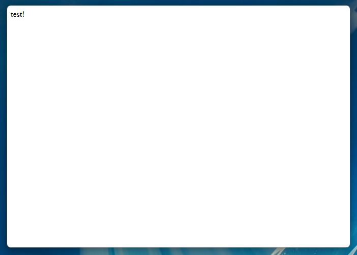
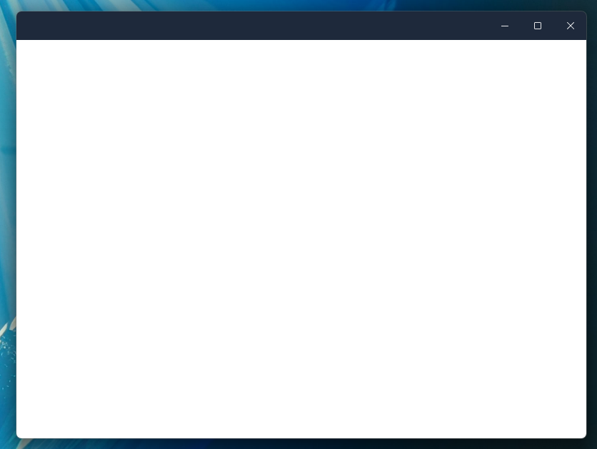
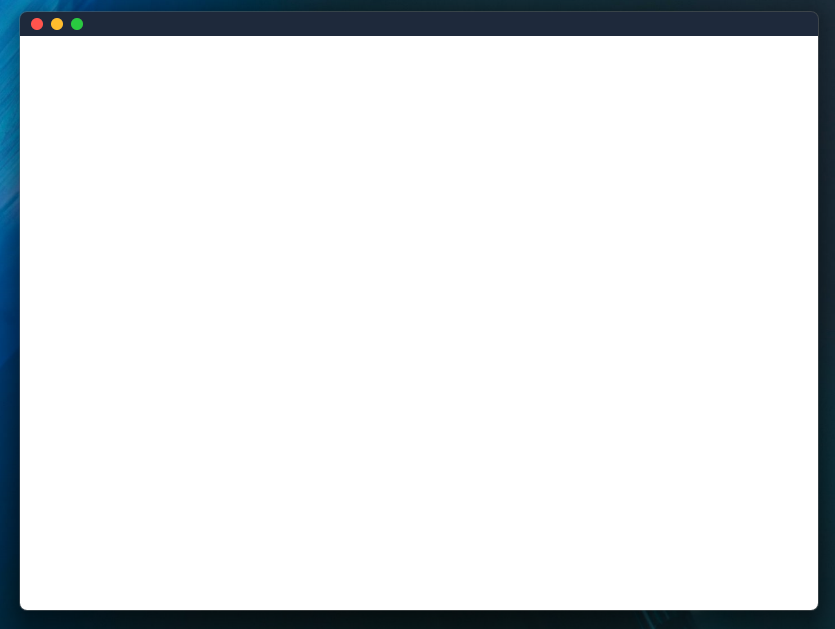

Tauri provides a lot of flexibility when it comes to customizing how you
want your application to look! You can create custom titlebars, transparent
windows, and more. This guide will go over how you can create a custom titlebar
for your Tauri application, written in React/Tailwind and cross-platform.

This guide assumes you have a already went over the
[Prerequisites](/start/prerequisites/) and have everything set up to develop a
Tauri application locally. This guide will cover how to make a custom titlebar
with React, but you can use any front-end framework you'd like.

Special thanks to [agmmnn](https://github.com/agmmnn) as he has a [Tauri Controls](https://github.com/agmmnn/tauri-controls)
library that lets you do this with one component. This guide was inspired by that
library and goes into depth about creating your own titlebar component.

> All of the code for this guide can be found on [GitHub](https://github.com/avvo-na/titlebar-demo)

## Creating a New Project
Let's start by creating a new Tauri project. You can skip this section
if you already have a Tauri project set up.

import CommandTabs from '@components/CommandTabs.astro';

<CommandTabs
	npm="npm create tauri-app@latest -- --beta"
/>

:::tip[Choosing a Template]
For the purposes of this guide, we will be using Typescript/React/npm.
However, you can use package manager or front-end framework you'd like.

- Project name: `titlebar-demo`
- Choose which language to use for your frontend: `Typescript / Javascript`
- Choose your package manager: `npm`
- Choose your UI template: `React`
- Choose your UI flavor: `Typescript`
- Would you like to setup the project for mobile as well? `no`
:::

Now lets go into the project directory, install the dependencies,
and start the development server. We need to build the project at least
once to generate our capabilities file.

```bash
cd titlebar-demo
npm install
npm run tauri dev
```

### Adding Tailwind
To make our titlebar look nice, we will be using Tailwind CSS. Its much easier
to share styled components using it, so lets add it to our project. Of course,
the styles used in this guide are just examples, you can transfer them to normal
CSS or any other styling solution you'd like.

```bash
npm install --save-dev tailwindcss postcss autoprefixer
npx tailwindcss init -p
```

Now lets go over to our `tailwind.config.js` file and add the files we'd like
to use Tailwind with.

```js title=tailwind.config.js
/** @type {import('tailwindcss').Config} */
export default {
    content: ["./src/**/*.{js,ts,jsx,tsx}", "./index.html"],
    theme: {
        extend: {},
      },
    plugins: [],
}
```

Head over to our `src/styles.css` file and add the following Tailwind imports.
Feel free to delete any default styles in the file and any other `*.css` files,
if you'd wish to stick with Tailwind for your whole application.

```css title=src/styles.css
@import "tailwindcss/base";
@import "tailwindcss/components";
@import "tailwindcss/utilities";
```

## Setting Up a Borderless Window
After our project is set up and has cached a build, we can head over to
`src-tauri/tauri.conf.json` and setup a borderless window. This will allow
us to ditch the default titlebar and create our own. We do this by
setting the `decorations` property to `false`.

```json title=tauri.conf.json
{
  ...
  "windows": [
    {
      "title": "titlebar-demo",
      "width": 800,
      "height": 600,
      "decorations": false
    }
  ],
  ...
}
```

Next, lets go setup some permissions in our `capabilities/default.json` file.
By default, Tauri has some pretty strict permissions, so we need to allow
our application to have access to certain JS APIs. We will need to add
the following permissions to our `default.json` file.

```json title=capabilities/default.json
{
  ...,
  "permissions": [
    ...,
    "window:allow-start-dragging",
    "window:allow-toggle-maximize",
    "window:allow-minimize",
    "window:allow-close"
  ]
}
```

This will allow us to drag the window, maximize, minimize, and close the window.
Now we can start building our custom titlebar! If you want to learn more about
permissions and capabilities, check out the [Access Control List](/references/acl/).

## Building our Titlebar Component
There are many ways that styling could go about when adding a custom titlebar.
For this guide, we will be using a simple `div` element with some basic CSS.
We will pin the component to the top of the window and add some buttons to
minimize, maximize, and close the window. We will also go over some drag
functionality to allow the user to move the window around. This will have
to be platform specific, as MacOS/Windows/Linux have different styling
and looks for their titlebars.

To start, lets get rid of the default Vite home page and create a new empty div.
```tsx title=src/App.tsx
function App() {
  return <div>test!</div>;
}

export default App;
```

Finally, lets go ahead an make a `components/titlebar` folder, this is where we will store
our main titlebar components, and platform specific components. Lets also make a `titlebar.tsx`
component in that folder and put something basic inside of it.

```tsx title=src/components/titlebar.tsx
export function Titlebar() {
  return <div>titlebar</div>;
}
```

## Windows Style Titlebar
Cool! Now that we have our project set up, we can start building our custom titlebar.
Our app should look a little something like this.





### Keeping Window State
Lets lay some groundwork out for a flexible titlebar component. We need a couple of things.
We need to be able to reactively tell if the `Window` is defined, and we also need to be able
to close the window, maximize and minimize.

```tsx title=src/components/titlebar.tx
import { useCallback, useEffect, useState } from "react";
import type { Window } from "@tauri-apps/api/window";

export function Titlebar() {
  const [appWindow, setAppWindow] = useState<Window | null>(null);
  const [isWindowMaximized, setIsWindowMaximized] = useState(false);

  // Fetch the Tauri window plugin when the component mounts
  useEffect(() => {
    if (typeof window !== "undefined") {
      import("@tauri-apps/api").then((module) => {
        setAppWindow(module.window.getCurrent());
      });
    }
  }, []);

  // Update the isWindowMaximized state when the window is resized
  const updateIsWindowMaximized = useCallback(async () => {
    if (appWindow) {
      const _isWindowMaximized = await appWindow.isMaximized();
      setIsWindowMaximized(_isWindowMaximized);
    }
  }, [appWindow]);

  useEffect(() => {
    updateIsWindowMaximized();
    let unlisten: () => void;

    const listen = async () => {
      if (appWindow) {
        unlisten = await appWindow.onResized(() => {
          void updateIsWindowMaximized();
        });
      }
    };
    listen();

    // Cleanup the listener when the component unmounts
    return () => unlisten && unlisten();
  }, [appWindow, updateIsWindowMaximized]);

  return (
    <div
      className="flex select-none flex-row overflow-hidden"
      data-tauri-drag-region
    >
      Titlebar
    </div>
  );
}
```

A couple of things to note here. We need to make sure that the `Window` is defined, if not
there is a major problem! Once that is defined, lets go ahead and set the window to some state.
Next, we are creating a callback to fire when the `Window` is resized! Finally, another important
point here is the `data-tauri-drag-region`, this will allow us to click anywhere on the div, and
drag the window around.

There is also our effect, which depends on the data provided by `updateIsWindowMaximized`. We
need to be able to check if the window state changes from outside sources, such as a user
double clicking on the titlebar of our appliation. This effect pairs nicely with our callback
and keeps track of that state for us!

### Communicating with Tauri
Now lets go on to make some helper functions for our window. We need to actively check if the
`Window` is defined when doing actions upon it. You can see how we do that below.

```tsx title=src/components/titlebar.tx
import { useCallback, useEffect, useState } from "react";
import type { Window } from "@tauri-apps/api/window";

export function Titlebar() {
  const [appWindow, setAppWindow] = useState<Window | null>(null);
  const [isWindowMaximized, setIsWindowMaximized] = useState(false);

  // Fetch the Tauri window plugin when the component mounts
  useEffect(() => {
    if (typeof window !== "undefined") {
      import("@tauri-apps/api").then((module) => {
        setAppWindow(module.window.getCurrent());
      });
    }
  }, []);

  // Update the isWindowMaximized state when the window is resized
  const updateIsWindowMaximized = useCallback(async () => {
    if (appWindow) {
      const _isWindowMaximized = await appWindow.isMaximized();
      setIsWindowMaximized(_isWindowMaximized);
    }
  }, [appWindow]);

  // Helper functions to minimize, maximize, fullscreen, and close the window
  const minimizeWindow = async () => {
    if (appWindow) {
      await appWindow.minimize();
    }
  };

  const maximizeWindow = async () => {
    if (appWindow) {
      await appWindow.toggleMaximize();
    }
  };

  const fullscreenWindow = async () => {
    if (appWindow) {
      const fullscreen = await appWindow.isFullscreen();
      if (fullscreen) {
        await appWindow.setFullscreen(false);
      } else {
        await appWindow.setFullscreen(true);
      }
    }
  };

  const closeWindow = async () => {
    if (appWindow) {
      await appWindow.close();
    }
  };

  return (
    <div
      className="flex select-none flex-row overflow-hidden"
      data-tauri-drag-region
    >
      Titlebar
    </div>
  );
}
```

### Using SVG Icons
We need to be able to have different icons for our buttons. Of course, you could use any
icons that you would like, but I have curated some SVG's that mimmick the feal of a real
modern Windows UI. Lets go ahead and put these in a separate file for ease of use. Let's
make a `src/components/titlebar/icons.tsx` file and store them there.

```tsx title=src/components/titlebar/icons.tsx
import type { SVGProps } from "react";

export const Icons = {
  minimizeWin: (props: JSX.IntrinsicAttributes & SVGProps<SVGSVGElement>) => (
    <svg
      width="10"
      height="1"
      viewBox="0 0 10 1"
      fill="none"
      xmlns="http://www.w3.org/2000/svg"
      {...props}
    >
      <path
        d="M0.498047 1.00098C0.429688 1.00098 0.364583 0.987956 0.302734 0.961914C0.244141 0.935872 0.192057 0.900065 0.146484 0.854492C0.100911 0.808919 0.0651042 0.756836 0.0390625 0.698242C0.0130208 0.636393 0 0.571289 0 0.50293C0 0.43457 0.0130208 0.371094 0.0390625 0.3125C0.0651042 0.250651 0.100911 0.19694 0.146484 0.151367C0.192057 0.102539 0.244141 0.0651042 0.302734 0.0390625C0.364583 0.0130208 0.429688 0 0.498047 0H9.50195C9.57031 0 9.63379 0.0130208 9.69238 0.0390625C9.75423 0.0651042 9.80794 0.102539 9.85352 0.151367C9.89909 0.19694 9.9349 0.250651 9.96094 0.3125C9.98698 0.371094 10 0.43457 10 0.50293C10 0.571289 9.98698 0.636393 9.96094 0.698242C9.9349 0.756836 9.89909 0.808919 9.85352 0.854492C9.80794 0.900065 9.75423 0.935872 9.69238 0.961914C9.63379 0.987956 9.57031 1.00098 9.50195 1.00098H0.498047Z"
        fill="currentColor"
        fillOpacity="0.8956"
      />
    </svg>
  ),
  maximizeWin: (props: JSX.IntrinsicAttributes & SVGProps<SVGSVGElement>) => (
    <svg
      width="10"
      height="10"
      viewBox="0 0 10 10"
      fill="none"
      xmlns="http://www.w3.org/2000/svg"
      {...props}
    >
      <path
        d="M1.47461 10.001C1.2793 10.001 1.09212 9.96191 0.913086 9.88379C0.734049 9.80241 0.576172 9.69499 0.439453 9.56152C0.30599 9.4248 0.198568 9.26693 0.117188 9.08789C0.0390625 8.90885 0 8.72168 0 8.52637V1.47559C0 1.28027 0.0390625 1.0931 0.117188 0.914062C0.198568 0.735026 0.30599 0.578776 0.439453 0.445312C0.576172 0.308594 0.734049 0.201172 0.913086 0.123047C1.09212 0.0416667 1.2793 0.000976562 1.47461 0.000976562H8.52539C8.7207 0.000976562 8.90788 0.0416667 9.08691 0.123047C9.26595 0.201172 9.4222 0.308594 9.55566 0.445312C9.69238 0.578776 9.7998 0.735026 9.87793 0.914062C9.95931 1.0931 10 1.28027 10 1.47559V8.52637C10 8.72168 9.95931 8.90885 9.87793 9.08789C9.7998 9.26693 9.69238 9.4248 9.55566 9.56152C9.4222 9.69499 9.26595 9.80241 9.08691 9.88379C8.90788 9.96191 8.7207 10.001 8.52539 10.001H1.47461ZM8.50098 9C8.56934 9 8.63281 8.98698 8.69141 8.96094C8.75326 8.9349 8.80697 8.89909 8.85254 8.85352C8.89811 8.80794 8.93392 8.75586 8.95996 8.69727C8.986 8.63542 8.99902 8.57031 8.99902 8.50195V1.5C8.99902 1.43164 8.986 1.36816 8.95996 1.30957C8.93392 1.24772 8.89811 1.19401 8.85254 1.14844C8.80697 1.10286 8.75326 1.06706 8.69141 1.04102C8.63281 1.01497 8.56934 1.00195 8.50098 1.00195H1.49902C1.43066 1.00195 1.36556 1.01497 1.30371 1.04102C1.24512 1.06706 1.19303 1.10286 1.14746 1.14844C1.10189 1.19401 1.06608 1.24772 1.04004 1.30957C1.014 1.36816 1.00098 1.43164 1.00098 1.5V8.50195C1.00098 8.57031 1.014 8.63542 1.04004 8.69727C1.06608 8.75586 1.10189 8.80794 1.14746 8.85352C1.19303 8.89909 1.24512 8.9349 1.30371 8.96094C1.36556 8.98698 1.43066 9 1.49902 9H8.50098Z"
        fill="currentColor"
        fillOpacity="0.8956"
      />
    </svg>
  ),
  maximizeRestoreWin: (
    props: JSX.IntrinsicAttributes & SVGProps<SVGSVGElement>,
  ) => (
    <svg
      width="10"
      height="11"
      viewBox="0 0 10 11"
      fill="none"
      xmlns="http://www.w3.org/2000/svg"
      {...props}
    >
      <path
        d="M8.99902 2.98096C8.99902 2.71077 8.94531 2.45687 8.83789 2.21924C8.73047 1.97835 8.58398 1.77002 8.39844 1.59424C8.21615 1.4152 8.00293 1.27523 7.75879 1.17432C7.5179 1.07015 7.264 1.01807 6.99707 1.01807H2.08496C2.13704 0.868327 2.21029 0.731608 2.30469 0.60791C2.39909 0.484212 2.50814 0.378418 2.63184 0.290527C2.75553 0.202637 2.89062 0.135905 3.03711 0.090332C3.18685 0.0415039 3.34147 0.0170898 3.50098 0.0170898H6.99707C7.41048 0.0170898 7.79948 0.0968424 8.16406 0.256348C8.52865 0.412598 8.84603 0.625814 9.11621 0.895996C9.38965 1.16618 9.60449 1.48356 9.76074 1.84814C9.92025 2.21273 10 2.60173 10 3.01514V6.51611C10 6.67562 9.97559 6.83024 9.92676 6.97998C9.88118 7.12646 9.81445 7.26156 9.72656 7.38525C9.63867 7.50895 9.53288 7.618 9.40918 7.7124C9.28548 7.8068 9.14876 7.88005 8.99902 7.93213V2.98096ZM1.47461 10.0171C1.2793 10.0171 1.09212 9.97803 0.913086 9.8999C0.734049 9.81852 0.576172 9.7111 0.439453 9.57764C0.30599 9.44092 0.198568 9.28304 0.117188 9.104C0.0390625 8.92497 0 8.73779 0 8.54248V3.49365C0 3.29508 0.0390625 3.10791 0.117188 2.93213C0.198568 2.75309 0.30599 2.59684 0.439453 2.46338C0.576172 2.32666 0.732422 2.21924 0.908203 2.14111C1.08724 2.05973 1.27604 2.01904 1.47461 2.01904H6.52344C6.72201 2.01904 6.91081 2.05973 7.08984 2.14111C7.26888 2.21924 7.42513 2.32503 7.55859 2.4585C7.69206 2.59196 7.79785 2.74821 7.87598 2.92725C7.95736 3.10628 7.99805 3.29508 7.99805 3.49365V8.54248C7.99805 8.74105 7.95736 8.92985 7.87598 9.10889C7.79785 9.28467 7.69043 9.44092 7.55371 9.57764C7.42025 9.7111 7.264 9.81852 7.08496 9.8999C6.90918 9.97803 6.72201 10.0171 6.52344 10.0171H1.47461ZM6.49902 9.01611C6.56738 9.01611 6.63086 9.00309 6.68945 8.97705C6.7513 8.95101 6.80501 8.9152 6.85059 8.86963C6.89941 8.82406 6.93685 8.77197 6.96289 8.71338C6.98893 8.65153 7.00195 8.58643 7.00195 8.51807V3.51807C7.00195 3.44971 6.98893 3.3846 6.96289 3.32275C6.93685 3.2609 6.90104 3.20719 6.85547 3.16162C6.8099 3.11605 6.75618 3.08024 6.69434 3.0542C6.63249 3.02816 6.56738 3.01514 6.49902 3.01514H1.49902C1.43066 3.01514 1.36556 3.02816 1.30371 3.0542C1.24512 3.08024 1.19303 3.11768 1.14746 3.1665C1.10189 3.21208 1.06608 3.26579 1.04004 3.32764C1.014 3.38623 1.00098 3.44971 1.00098 3.51807V8.51807C1.00098 8.58643 1.014 8.65153 1.04004 8.71338C1.06608 8.77197 1.10189 8.82406 1.14746 8.86963C1.19303 8.9152 1.24512 8.95101 1.30371 8.97705C1.36556 9.00309 1.43066 9.01611 1.49902 9.01611H6.49902Z"
        fill="currentColor"
        fillOpacity="0.8956"
      />
    </svg>
  ),
  closeWin: (props: JSX.IntrinsicAttributes & SVGProps<SVGSVGElement>) => (
    <svg
      width="10"
      height="10"
      viewBox="0 0 10 10"
      fill="none"
      xmlns="http://www.w3.org/2000/svg"
      {...props}
    >
      <path
        d="M5 5.70898L0.854492 9.85449C0.756836 9.95215 0.639648 10.001 0.50293 10.001C0.359701 10.001 0.239258 9.95378 0.141602 9.85938C0.0472005 9.76172 0 9.64128 0 9.49805C0 9.36133 0.0488281 9.24414 0.146484 9.14648L4.29199 5.00098L0.146484 0.855469C0.0488281 0.757812 0 0.638997 0 0.499023C0 0.430664 0.0130208 0.36556 0.0390625 0.303711C0.0651042 0.241862 0.100911 0.189779 0.146484 0.147461C0.192057 0.101888 0.245768 0.0660807 0.307617 0.0400391C0.369466 0.0139974 0.43457 0.000976562 0.50293 0.000976562C0.639648 0.000976562 0.756836 0.0498047 0.854492 0.147461L5 4.29297L9.14551 0.147461C9.24316 0.0498047 9.36198 0.000976562 9.50195 0.000976562C9.57031 0.000976562 9.63379 0.0139974 9.69238 0.0400391C9.75423 0.0660807 9.80794 0.101888 9.85352 0.147461C9.89909 0.193034 9.9349 0.246745 9.96094 0.308594C9.98698 0.367188 10 0.430664 10 0.499023C10 0.638997 9.95117 0.757812 9.85352 0.855469L5.70801 5.00098L9.85352 9.14648C9.95117 9.24414 10 9.36133 10 9.49805C10 9.56641 9.98698 9.63151 9.96094 9.69336C9.9349 9.75521 9.89909 9.80892 9.85352 9.85449C9.8112 9.90007 9.75911 9.93587 9.69727 9.96191C9.63542 9.98796 9.57031 10.001 9.50195 10.001C9.36198 10.001 9.24316 9.95215 9.14551 9.85449L5 5.70898Z"
        fill="currentColor"
        fillOpacity="0.8956"
      />
    </svg>
  ),
};
```

### Styling our Titlebar
Now that we are keeping the correct state in terms of the application being resized, we can
go on to use our beautiful icons in our titlebar! Styling this is a matter of preference, but
I will provide you with a helpful starter component. Later down the line if you wish to change the
styling depending on the type of platform you are on, it will be easy to extract out to another
component. For simplicity, we are keeping everything in one component for now.

```tsx title=src/components/titlebar/titlebar.tsx
import { Icons } from "./icons"; // <-- Gotta import our new icons!

export function Titlebar() {

  // ...

  return (
    <div
      className="flex select-none flex-row overflow-hidden bg-slate-200"
      data-tauri-drag-region
    >
      <div className="flex items-center h-10 ml-auto"> {/* <-- Set the side! */}
        <button
          onClick={minimizeWindow}
          className="max-h-10 w-[46px] cursor-default rounded-none bg-transparent
          text-black hover:bg-black/[.05] active:bg-black/[.03] dark:text-white
          dark:hover:bg-white/[.06] dark:active:bg-white/[.04]
          inline-flex items-center justify-center h-10"
        >
          <Icons.minimizeWin />
        </button>
        <button
          onClick={maximizeWindow}
          className="max-h-10 w-[46px] cursor-default rounded-none bg-transparent
          text-black hover:bg-black/[.05] active:bg-black/[.03] dark:text-white
          dark:hover:bg-white/[.06] dark:active:bg-white/[.04]
          inline-flex items-center justify-center h-10"
        >
          {!isWindowMaximized ? (
            <Icons.maximizeWin />
          ) : (
            <Icons.maximizeRestoreWin />
          )}
        </button>
        <button
          onClick={closeWindow}
          className="max-h-10 w-[46px] cursor-default rounded-none bg-transparent
          text-black hover:bg-[#c42b1c] hover:text-white active:bg-[#c42b1c]/90
          dark:text-white inline-flex items-center justify-center h-10"
        >
          <Icons.closeWin />
        </button>
      </div>
    </div>
  );
}
```

Some things to note here, the background is set as `bg-slate-200` this is to be able
to see the icons. However, we have set conditional styling as to when the theme of
the application changes to `dark` mode, we can set those icons to white.

Another great observation of this code is the fact that we are adhering to changing
the icons when we are maximized. On Windows we should make it clear to the user that
we are in fullscreen mode, and our "middle" button would now take us *out* of fullscreen.

Finally, we are setting the left margin on our wrapper div with `ml-auto`, this will just
chuck our div to the right of the screen. You can put this wherever you want! P.S. on Mac systems
we will have to have this on the right side!


### Positioning our Titlebar
The `titlebar` component that we have built to day is just a standard dive with `inline-flex`,
this means that you can put it anywhere in your application. If you want to set an absolute
position to the top, you're welcome to do that. Often times, instead of using absolute positioning
its easier to use CSS's flexbox layout throughout your application.

### That's it!
You've built a custom titlebar for your tauri application! If you want to check out the full
source code for this you can head over to the [repository](https://github.com/avvo-na/titlebar-demo)
and see it. If you've been following along your titlebar might look a little something like this!



## Mac Style Titlebar
Making a titlebar that looks native on the OSX end of things is just as easy. If you haven't
read through the Windows portion of this guide, give it a read! We will be building upon that!
Lets go ahead and move that Windows based code to a different file `windows.tsx` and rename
the function that it exports `Windows()`. We will also create a file `mac.tsx` and export
the function `Mac()` there. The concept will be very similar, and at the end we'll get into
conditionally rendering a titlebar based on the platform that you are on.

### Keeping Window State
Now inside of our `mac.tsx` file, lets setup our state. This is *almost* a copy of our old
window state manager, but I'll include it here incase you've skipped over to the Mac
section of this guide. 😁

```tsx title=src/components/titlebar/mac.tsx

import { useCallback, useEffect, useState } from "react";
import type { Window } from "@tauri-apps/api/window";

export function Mac() {
  const [appWindow, setAppWindow] = useState<Window | null>(null);

  // Fetch the Tauri window plugin when the component mounts
  useEffect(() => {
    if (typeof window !== "undefined") {
      import("@tauri-apps/api").then((module) => {
        setAppWindow(module.window.getCurrent());
      });
    }
  }, []);

  // Helper functions to minimize, maximize, fullscreen, and close the window
  const minimizeWindow = async () => {
    if (appWindow) {
      await appWindow.minimize();
    }
  };

  const maximizeWindow = async () => {
    if (appWindow) {
      await appWindow.toggleMaximize();
    }
  };

  const closeWindow = async () => {
    if (appWindow) {
      await appWindow.close();
    }
  };

  return (
    {/* ... */}
  );
}
```
### Mac Specific Window Properties
That was pretty much a copy of our old window state manager, but we need to add some key
additions if we want a Mac style titlebar!

```tsx title=src/components/titlebar/mac.tsx
import { useCallback, useEffect, useState } from "react";
import type { Window } from "@tauri-apps/api/window";
import { Icons } from "./icons";

export function Mac() {
  // ...

  // Handle that fullscreen!
  const fullscreenWindow = async () => {
    if (appWindow) {
      const fullscreen = await appWindow.isFullscreen();
      if (fullscreen) {
        await appWindow.setFullscreen(false);
      } else {
        await appWindow.setFullscreen(true);
      }
    }
  };

  // We need to listen for the alt key!
  const [isAltKeyPressed, setIsAltKeyPressed] = useState(false)
  const [isHovering, setIsHovering] = useState(false)
  const last = isAltKeyPressed ? <Icons.plusMac /> : <Icons.fullMac />
  const key = "Alt"

  // Some handy helper functions
  const handleMouseEnter = () => {
    setIsHovering(true)
  }
  const handleMouseLeave = () => {
    setIsHovering(false)
  }

  const handleAltKeyDown = (e: KeyboardEvent) => {
    if (e.key === key) {
      setIsAltKeyPressed(true)
    }
  }
  const handleAltKeyUp = (e: KeyboardEvent) => {
    if (e.key === key) {
      setIsAltKeyPressed(false)
    }
  }

  // Attach event listeners when the component mounts
  useEffect(() => {
    window.addEventListener("keydown", handleAltKeyDown)
    window.addEventListener("keyup", handleAltKeyUp)
  }, [])

  return (
    {/* ... */}
  );
}
```

Here we are setting up window listeners that will update our state and let us know
if the alt key is being pressed down. That way we can really mimmic mac behavior.
We are also making sure to use different icons *if* we are pressing down the alt key.

### Adding in Mac Styled SVG Icons
Now you may notice that we are using some new icons! Mac has its own design philosophy so
if we want our controls to really look native lets setup some new icons. We'll go back
to our `icons.tsx` file and add some more!

```tsx src/components/titlebar/icons.tsx
import type { SVGProps } from "react";

export const Icons = {
  // ...
  closeMac: (props: JSX.IntrinsicAttributes & SVGProps<SVGSVGElement>) => (
    <svg
      width="6"
      height="6"
      viewBox="0 0 16 18"
      fill="none"
      xmlns="http://www.w3.org/2000/svg"
      {...props}
    >
      <path
        d="M15.7522 4.44381L11.1543 9.04165L15.7494 13.6368C16.0898 13.9771 16.078 14.5407 15.724 14.8947L13.8907 16.728C13.5358 17.0829 12.9731 17.0938 12.6328 16.7534L8.03766 12.1583L3.44437 16.7507C3.10402 17.091 2.54132 17.0801 2.18645 16.7253L0.273257 14.8121C-0.0807018 14.4572 -0.0925004 13.8945 0.247845 13.5542L4.84024 8.96087L0.32499 4.44653C-0.0153555 4.10619 -0.00355681 3.54258 0.350402 3.18862L2.18373 1.35529C2.53859 1.00042 3.1013 0.989533 3.44164 1.32988L7.95689 5.84422L12.5556 1.24638C12.8951 0.906035 13.4587 0.917833 13.8126 1.27179L15.7267 3.18589C16.0807 3.53985 16.0925 4.10346 15.7522 4.44381Z"
        fill="currentColor"
      />
    </svg>
  ),
  minMac: (props: JSX.IntrinsicAttributes & SVGProps<SVGSVGElement>) => (
    <svg
      width="8"
      height="8"
      viewBox="0 0 17 6"
      fill="none"
      xmlns="http://www.w3.org/2000/svg"
      {...props}
    >
      <g clipPath="url(#clip0_20_2051)">
        <path
          fillRule="evenodd"
          clipRule="evenodd"
          d="M1.47211 1.18042H15.4197C15.8052 1.18042 16.1179 1.50551 16.1179 1.90769V3.73242C16.1179 4.13387 15.8052 4.80006 15.4197 4.80006H1.47211C1.08665 4.80006 0.773926 4.47497 0.773926 4.07278V1.90769C0.773926 1.50551 1.08665 1.18042 1.47211 1.18042Z"
          fill="currentColor"
        />
      </g>
    </svg>
  ),
  fullMac: (props: JSX.IntrinsicAttributes & SVGProps<SVGSVGElement>) => (
    <svg
      width="6"
      height="6"
      viewBox="0 0 15 15"
      fill="none"
      xmlns="http://www.w3.org/2000/svg"
      {...props}
    >
      <g clipPath="url(#clip0_20_2057)">
        <path
          fillRule="evenodd"
          clipRule="evenodd"
          d="M3.53068 0.433838L15.0933 12.0409C15.0933 12.0409 15.0658 5.35028 15.0658 4.01784C15.0658 1.32095 14.1813 0.433838 11.5378 0.433838C10.6462 0.433838 3.53068 0.433838 3.53068 0.433838ZM12.4409 15.5378L0.87735 3.93073C0.87735 3.93073 0.905794 10.6214 0.905794 11.9538C0.905794 14.6507 1.79024 15.5378 4.43291 15.5378C5.32535 15.5378 12.4409 15.5378 12.4409 15.5378Z"
          fill="currentColor"
        />
      </g>
    </svg>
  ),
  plusMac: (props: JSX.IntrinsicAttributes & SVGProps<SVGSVGElement>) => (
    <svg
      width="8"
      height="8"
      viewBox="0 0 17 16"
      fill="none"
      xmlns="http://www.w3.org/2000/svg"
      {...props}
    >
      <g clipPath="url(#clip0_20_2053)">
        <path
          fillRule="evenodd"
          clipRule="evenodd"
          d="M15.5308 9.80147H10.3199V15.0095C10.3199 15.3949 9.9941 15.7076 9.59265 15.7076H7.51555C7.11337 15.7076 6.78828 15.3949 6.78828 15.0095V9.80147H1.58319C1.19774 9.80147 0.88501 9.47638 0.88501 9.07419V6.90619C0.88501 6.50401 1.19774 6.17892 1.58319 6.17892H6.78828V1.06183C6.78828 0.676375 7.11337 0.363647 7.51555 0.363647H9.59265C9.9941 0.363647 10.3199 0.676375 10.3199 1.06183V6.17892H15.5308C15.9163 6.17892 16.229 6.50401 16.229 6.90619V9.07419C16.229 9.47638 15.9163 9.80147 15.5308 9.80147Z"
          fill="currentColor"
        />
      </g>
    </svg>
  ),
};
```

### Styling our Titlebar
Now that we have styled our Mac titlebar, we need to make sure that we can style it properly.
I've included a native-looking set of buttons below, that also adhere to some of Apple's
design resources. Feel free to edit them as much as you'd like!

```tsx title=src/components/mac.tsx
export function Mac() {

  // ...

  return (
    <div
      className="flex select-none flex-row overflow-hidden bg-slate-800"
      data-tauri-drag-region
    >
      <div
        className="space-x-2 px-3 text-black active:text-black dark:text-black"
        onMouseEnter={handleMouseEnter}
        onMouseLeave={handleMouseLeave}
      >
        <button
          onClick={closeWindow}
          className="aspect-square h-3 w-3 cursor-default content-center
          items-center justify-center self-center rounded-full border
          border-black/[.12] bg-[#ff544d] text-center text-black/60
          hover:bg-[#ff544d] active:bg-[#bf403a] active:text-black/60
          dark:border-none"
        >
          {isHovering && <Icons.closeMac />}
        </button>
        <button
          onClick={minimizeWindow}
          className="aspect-square h-3 w-3 cursor-default content-center
          items-center justify-center self-center rounded-full border
          border-black/[.12] bg-[#ffbd2e] text-center text-black/60
          hover:bg-[#ffbd2e] active:bg-[#bf9122] active:text-black/60
          dark:border-none"
        >
          {isHovering && <Icons.minMac />}
        </button>
        <button
          onClick={isAltKeyPressed ? maximizeWindow : fullscreenWindow}
          className="aspect-square h-3 w-3 cursor-default content-center
          items-center justify-center self-center rounded-full border
          border-black/[.12] bg-[#28c93f] text-center text-black/60
          hover:bg-[#28c93f] active:bg-[#1e9930] active:text-black/60
          dark:border-none"
        >
          {isHovering && last}
        </button>
      </div>
    </div>
  );
}
```

### Positioning our Titlebar
As said before, this is just a flex container that has buttons on the left side. If you want to
set absolute positioning for this, you can do so. Often times, instead of using absolute positioning
its easier to use CSS's flexbox layout throughout your application.

### That's it!
Yay! We should now have a native-looking Mac styled titlebar that also implements functionality
that is native to OSX. If you've been following along, your title bar may look something like this.



## Platform Dependent Rendering
Now, if you've made it this far, you should have separate `windows.tsx` and `mac.tsx` titlebars.
Theres an easy way to integrate with Tauri to check if our application is on either of those
platforms. We can use the `@tauri-apps/plugin-os` plugin in order to check that. Let's set it up!

### Installing Required Plugins
Run the following command to add the plugin's JS bindings.
```sh
npm install @tauri-apps/plugin-os
```

Now lets go over to our `src-tauri` directory and run the following commands.
```sh
cargo add tauri-plugin-os
```

Let's register the plugins from within Tauri as well, inside of our `main.rs` file.

```rust title=src-tauri/src/main.rs
fn main() {
    tauri::Builder::default()
        .plugin(tauri_plugin_shell::init())
        .plugin(tauri_plugin_os::init())
        .invoke_handler(tauri::generate_handler![greet])
        .run(tauri::generate_context!())
        .expect("error while running tauri application");
}
```

Finally lets allow the application to check the os type in our `capabilities/default.json`
file.

```json title=src-tauri/capabilities/default.json
{
  ...,
  "permissions": [
    ...,
    "os:allow-os-type"
  ]
}
```


### Dynamically Checking the OS
Checking the OS that the application is running on is as easy as using the `type()` function from
the `plugin-os` module. We can do that and then conditionally render the titlebar that we would like.
There are many ways to do this, but I have written a `titlebar` component that renders different
titlebars depending on the OS that is returned.

```tsx title=src/components/titlebar/titlebar.tsx
import { useEffect, useState } from "react";
import { Mac } from "./mac";
import { Windows } from "./windows";
import { type } from "@tauri-apps/plugin-os";

export function Titlebar() {
  // Hold the OS type in state
  const [osType, setOsType] = useState<string | undefined>(undefined);

  // Fetch the OS type from the plugin
  const getOsType = async () => {
    await type()
      .then((type) => {
        setOsType(type);
      })
      .catch(console.error);
  };

  // Check our OS type when the component mounts
  useEffect(() => {
    getOsType();
  }, []);

  switch (osType) {
    case "macos":
      return <Mac />;
    case "windows":
      return <Windows />;
    default:
      return <Windows />;
  }
}
```

As you can see we are getting the OS type on mount and then rendering the title bar based on that.
Thats it! Now you have a titlebar component that works on both Windows and Mac!

## Code
The code for this guide is hosted on Github [here](https://github.com/avvo-na/titlebar-demo)
and will be available for use under the MIT license. Thanks for reading this far, and special thanks
to [agmmnn](https://github.com/agmmnn) for the inspiration.


