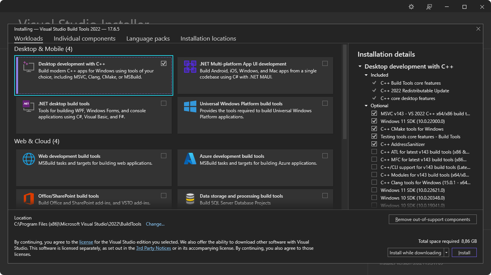

import { Tabs, TabItem, Card } from '@astrojs/starlight/components';

Projenizi Tauri ile oluşturmaya başlamak için öncelikle birkaç bağımlılığı yüklemeniz gerekir:

1. [Sistem Bağımlılıkları](#sistem-bağımlılıkları)
2. [Rust](#rust)
3. [Mobil Uygulamalar İçin Yapılandırma](#mobil-uygulamalar-için-yapılandırma) (yalnızca mobil cihazlar için geliştiriliyorsa gereklidir)

## Sistem Bağımlılıkları

İlgili işletim sisteminizle başlamak için bağlantıyı takip edin:

- [Linux](#linux) (belirli dağıtımlar için aşağıya bakın)
- [macOS Catalina (10.15) ve sonrası](#macos)
- [Windows 7 ve sonrası](#windows)

### Linux

Tauri, Linux üzerinde geliştirme için çeşitli sistem bağımlılıklarına ihtiyaç duyar. Bunlar dağıtımınıza bağlı olarak farklı olabilir, ancak kurulum yapmanıza yardımcı olmak için aşağıda bazı popüler dağıtımları ekledik.
{/* Note: These are the officially supported linux distributions. */}
{/* If you wish to add another please open an issue to discuss prior to opening a PR */}

<Tabs>
  <TabItem label="Debian">

```sh
sudo apt update
sudo apt install libwebkit2gtk-4.1-dev \
  build-essential \
  curl \
  wget \
  file \
  libssl-dev \
  libayatana-appindicator3-dev \
  librsvg2-dev
```

  </TabItem>
  <TabItem label="Arch">

```sh
sudo pacman -Syu
sudo pacman -S --needed \
  webkit2gtk-4.1 \
  base-devel \
  curl \
  wget \
  file \
  openssl \
  appmenu-gtk-module \
  libappindicator-gtk3 \
  librsvg \
  libvips
```

  </TabItem>
  <TabItem label="Fedora">

```sh
sudo dnf check-update
sudo dnf install webkit2gtk4.1-devel \
  openssl-devel \
  curl \
  wget \
  file \
  libappindicator-gtk3-devel \
  librsvg2-devel
sudo dnf group install "C Development Tools and Libraries"
```

  </TabItem>
  <TabItem label="Gentoo">

```sh
sudo emerge --ask \
  net-libs/webkit-gtk:4.1 \
  dev-libs/libappindicator \
  net-misc/curl \
  net-misc/wget \
  sys-apps/file
```

  </TabItem>
  <TabItem label="openSUSE">

```sh
sudo zypper up
sudo zypper in webkit2gtk3-devel \
  libopenssl-devel \
  curl \
  wget \
  file \
  libappindicator3-1 \
  librsvg-devel
sudo zypper in -t pattern devel_basis
```

  </TabItem>
  <TabItem label="NixOS">

TODO: Need to build out NixOS instructions

  </TabItem>
</Tabs>

Dağıtımınız yukarıda yer almıyorsa, bir kılavuz oluşturulup oluşturulmadığını görmek için [Awesome Tauri on GitHub] (https://github.com/tauri-apps/awesome-tauri#guides) adresini kontrol etmek isteyebilirsiniz.

Sonraki: [Rust'u Yükleyin](#rust)

### macOS

Tauri [Xcode](https://developer.apple.com/xcode/resources/) ve çeşitli macOS ve iOS geliştirme bağımlılıklarını kullanır.

Xcode'u aşağıdaki yerlerden birinden indirin ve yükleyin:

- [Mac App Store](https://apps.apple.com/gb/app/xcode/id497799835?mt=12)
- [Apple Geliştirici web sitesi](https://developer.apple.com/xcode/resources/)

Kurulumu tamamlayabilmesi için yükledikten sonra Xcode'u başlattığınızdan emin olun.

<details>
<summary>Yalnızca masaüstü uygulamaları için mi geliştiriyorsunuz?</summary>
Yalnızca masaüstü uygulamaları geliştirmeyi planlıyorsanız ve iOS'u hedeflemiyorsanız bunun yerine Xcode Komut Satırı Araçlarını yükleyebilirsiniz:

```sh
xcode-select --install
```

</details>

Sonraki: [Rust'u Yükleyin](#rust)

### Windows

Tauri, geliştirme için Microsoft C++ Derleme Araçlarının yanı sıra Microsoft Edge WebView2'yi de kullanıyor. Bunların her ikisi de Windows'ta geliştirme için gereklidir.

Gerekli bağımlılıkları yüklemek için aşağıdaki adımları izleyin.

#### Microsoft C++ Build Tools

1. [Microsoft C++ Derleme Araçları](https://visualstudio.microsoft.com/visual-cpp-build-tools/) yükleyicisini indirin ve yüklemeye başlamak için açın.
2. Kurulum sırasında "C++ ile masaüstü geliştirme" seçeneğini işaretleyin.



Sonraki: [WebView2 Yükleyin](#webview2).

#### WebView2

:::tip
WebView 2, Windows 10'da (sürüm 1803'ten itibaren) ve Windows'un sonraki sürümlerinde zaten yüklüdür. Bu sürümlerden birinde geliştirme yapıyorsanız bu adımı atlayıp doğrudan [Rust'u yükleme](#rust) adımına gidebilirsiniz.
:::

Tauri, Windows'ta içerik oluşturmak için Microsoft Edge WebView2 kullanır.

WebView2'yi [WebView2 Runtime indirme bölümü] (https://developer.microsoft.com/en-us/microsoft-edge/webview2/#download-section) adresini ziyaret ederek yükleyin. "Evergreen Boostrapper "ı indirin ve kurun.

Sonraki: [Rust'u Yükleyin](#rust)

## Rust

Tauri, [Rust](https://www.rust-lang.org) ile oluşturulmuştur ve geliştirme için buna ihtiyaç duymaktadır. Aşağıdaki yöntemlerden birini kullanarak Rust'u yükleyin. Daha fazla kurulum yöntemini https://www.rust-lang.org/tools/install adresinde görebilirsiniz.

<Tabs>
  <TabItem label="Linux and macOS" class="content">

Aşağıdaki komutu kullanarak [`rustup`](https://github.com/rust-lang/rustup) aracılığıyla yükleyin:

```sh
curl --proto '=https' --tlsv1.2 https://sh.rustup.rs -sSf | sh
```

:::tip[Güvenlik İpucu]
Bu bash betiğini denetledik ve yapması gerektiğini söylediği şeyi yapıyor. Yine de, bir betiği körü körüne curl-bashing yapmadan önce, önce ona bakmak her zaman akıllıca olacaktır.

İşte düz bir betik olarak dosya: [rustup.sh](https://sh.rustup.rs/)
:::

  </TabItem>
  <TabItem label="Windows">
  
  `Rustup`ı yüklemek için https://www.rust-lang.org/tools/install adresini ziyaret edin.

  </TabItem>
</Tabs>

Değişikliklerin etkili olması için Terminalinizi (ve bazı durumlarda sisteminizi) yeniden başlattığınızdan emin olun.

Sonraki: Android ve iOS için derleme yapmak istiyorsanız [Mobil Uygulamalar İçin Yapılandırma](#mobil-uygulamalar-için-yapılandırma) veya bir JavaScript çerçevesi kullanmak istiyorsanız [Node yükleyin](#nodejs). Aksi takdirde [Create a Project](/guides/create/).

## Node.js

:::note[JavaScript ekosistemi]
Yalnızca bir JavaScript ön uç çerçevesi kullanmayı düşünüyorsanız
:::

1. Node.js web sitesine] (https://nodejs.org) gidin, Long Term Support (LTS) sürümünü indirin ve kurun.

2. Node'un başarılı bir şekilde kurulup kurulmadığını çalıştırarak kontrol edin:

```sh
node -v
# v20.10.0
npm -v
# 10.2.3
```

Yeni kurulumu tanıdığından emin olmak için Terminalinizi yeniden başlatmanız önemlidir. Bazı durumlarda bilgisayarınızı yeniden başlatmanız gerekebilir.

Node.js için npm varsayılan paket yöneticisi olsa da, pnpm veya yarn gibi diğerlerini de kullanabilirsiniz. Bunları etkinleştirmek için Terminalinizde `corepack enable` komutunu çalıştırın. Bu adım isteğe bağlıdır ve yalnızca npm dışında bir paket yöneticisi kullanmayı tercih ediyorsanız gereklidir.

Sonraki: [Mobil Uygulamalar İçin Yapılandırma](#mobil-uygulamalar-için-yapılandırma) yada [Bir proje oluşturun](/tr/guides/create/).

## Mobil Uygulamalar İçin Yapılandırma

Uygulamanızı Android veya iOS için hedeflemek istiyorsanız, yüklemeniz gereken birkaç ek bağımlılık vardır:

- Android](#android)
- [iOS](#ios)

### Android

1. Android Geliştiricileri web sitesinden Android Studio'yu indirin ve yükleyin](https://developer.android.com/studio)
2. `JAVA_HOME` ortam değişkenini ayarlayın:

{/* TODO: Can this be done in the 4th step? */}

<Tabs>
<TabItem label="Linux">

```sh
export JAVA_HOME=/opt/android-studio/jbr
```

</TabItem>
<TabItem label="macOS">

```sh
export JAVA_HOME="/Applications/Android Studio.app/Contents/jbr/Contents/Home"
```

</TabItem>
<TabItem label="Windows">

```ps
[System.Environment]::SetEnvironmentVariable("JAVA_HOME", "C:\Program Files\Android\Android Studio\jbr", "User")
```

</TabItem>
</Tabs>
3. Aşağıdakileri yüklemek için Android Studio'daki SDK Yöneticisini kullanın:

- Android SDK Platform
- Android SDK Platform Araçları
- NDK (Side by side)
- Android SDK Build-Tools
- Android SDK Komut Satırı Araçları

4. `ANDROID_HOME` ve `NDK_HOME` ortam değişkenlerini ayarlayın. Sürüm numaralarını, kurulu sürümünüzle eşleşecek şekilde değiştirin.

{/* TODO: Does the version number change below? */}

<Tabs>
<TabItem label="Linux">

```sh
export ANDROID_HOME="$HOME/Android/Sdk"
export NDK_HOME="$ANDROID_HOME/ndk/25.0.8775105"
```

</TabItem>
<TabItem label="macOS">

```sh
export ANDROID_HOME="$HOME/Library/Android/sdk"
export NDK_HOME="$ANDROID_HOME/ndk/25.0.8775105"
```

</TabItem>
<TabItem label="Windows">

{/* TODO: Do we need a note about this version? */}

```ps
[System.Environment]::SetEnvironmentVariable("ANDROID_HOME", "$env:LocalAppData\Android\Sdk", "User")
[System.Environment]::SetEnvironmentVariable("NDK_HOME", "$env:LocalAppData\Android\Sdk\ndk\25.0.8775105", "User")
```

</TabItem>

</Tabs>

5. Android derlemelerini(targets) `rustup` ile ekleyin:

<Tabs>
  <TabItem label="Linux and macOS" class="content">

```sh
rustup target add aarch64-linux-android armv7-linux-androideabi i686-linux-android x86_64-linux-android
```

  </TabItem>
  <TabItem label="Windows">
  
  ```ps
  rustup target add aarch64-linux-android armv7-linux-androideabi i686-linux-android x86_64-linux-android
  ```

  </TabItem>
</Tabs>

Sonraki: [iOS için Kurulum](#ios) yada [Bir proje oluşturun](/tr/guides/create/).

### iOS

:::caution[macOS Only]
iOS geliştirme Xcode gerektirir ve yalnızca macOS'ta kullanılabilir. [yemmacOS sistem bağımlılıkları bölümünde](#macos) Xcode Command Line Tools'u değil Xcode'u yüklediğinizden emin olun.
:::

1. Terminal'e `rustup` ile iOS hedeflerini ekleyin:

```sh
rustup target add aarch64-apple-ios x86_64-apple-ios aarch64-apple-ios-sim
```

2. [Homebrew](https://brew.sh) uygulamasını yükleyin:

```sh
/bin/bash -c "$(curl -fsSL https://raw.githubusercontent.com/Homebrew/install/HEAD/install.sh)"
```

3. Homebrew'u kullanarak [Cocoapods](https://cocoapods.org) uygulamasını yükleyin:

```sh
brew install cocoapods
```

Sonraki: [Bir proje oluşturun](/tr/guides/create/).

## Sorun giderme


Kurulum sırasında herhangi bir sorunla karşılaşırsanız [Sorun Giderme Kılavuzu](/tr/guides/troubleshoot)'na göz atmayı veya [Tauri Discord]'a (https://discord.com/invite/tauri) ulaşmayı unutmayın.

<Card title="Next Steps" icon="rocket">

Artık tüm önkoşulları yüklediğinize göre [ilk Tauri projenizi oluşturmaya](/tr/guides/create/) hazırsınız!

</Card>
