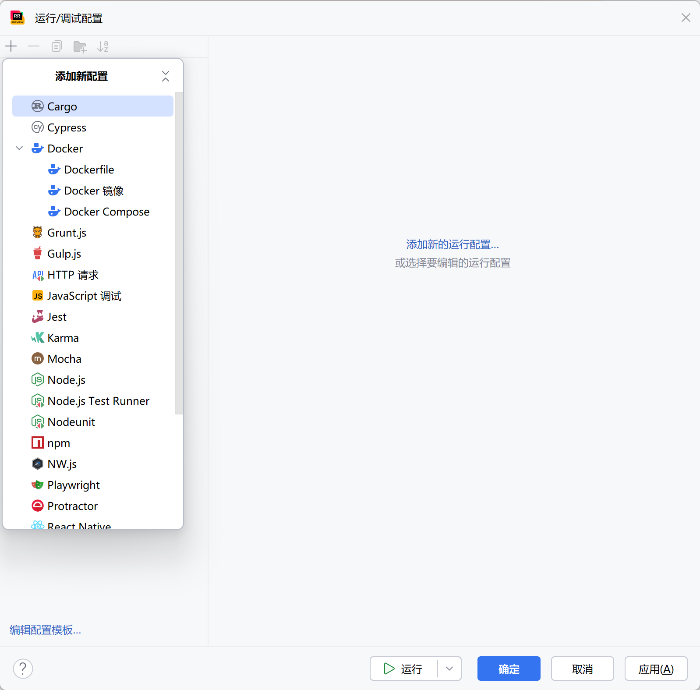
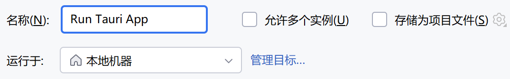
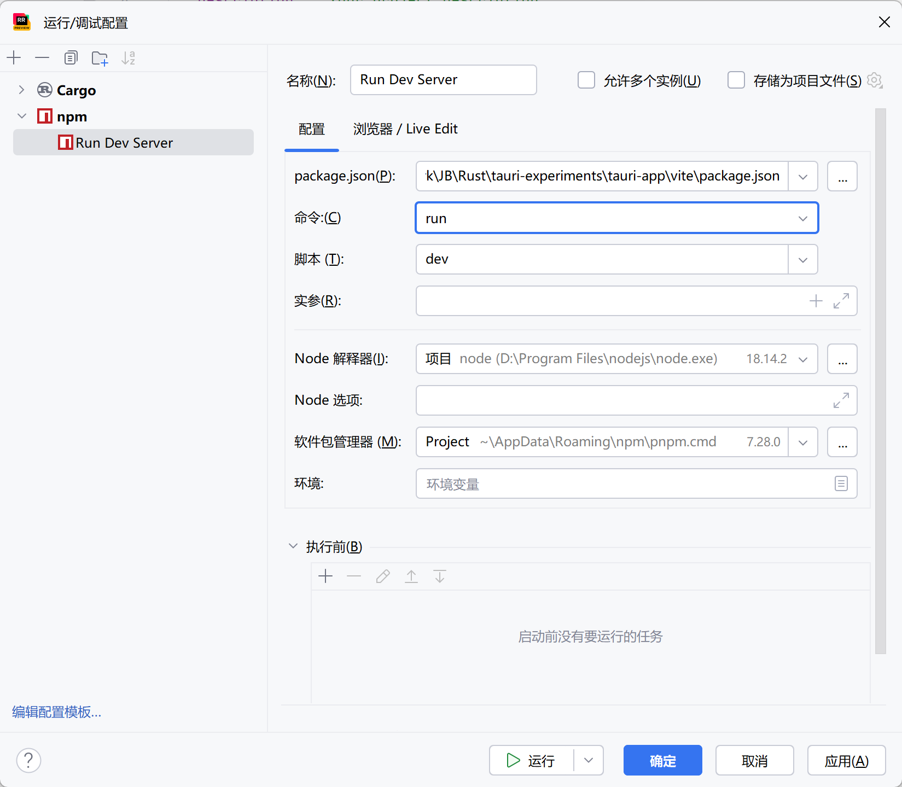
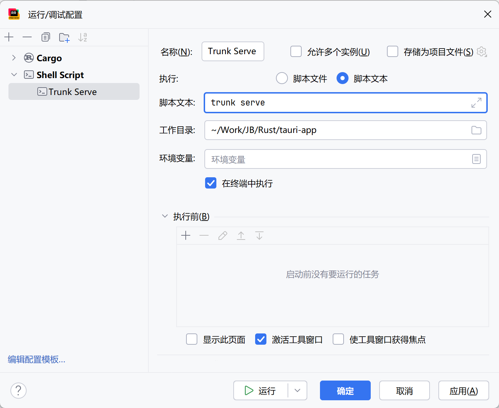
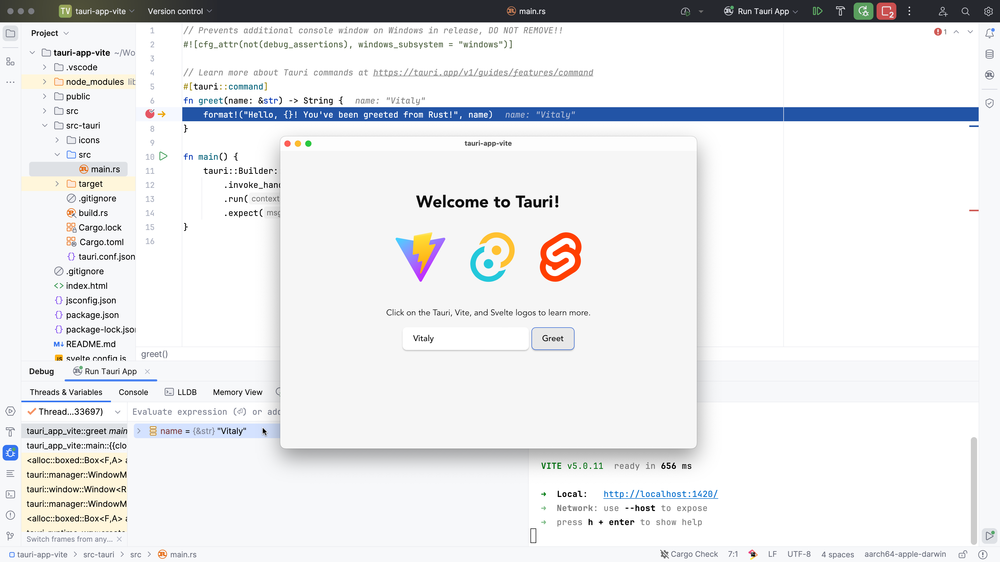

{/* TODO: Add support to light/dark mode images */}

在本指南中，我们将通过设置 JetBrains RustRover 来调试[你的 Tauri 应用的核心进程](/concept/process-model/#the-core-process)。这也基本适用于 IntelliJ 和 CLion 。

## 配置 Cargo 项目

根据项目所使用的前端技术栈，项目目录可能是也可能不是一个 Cargo 项目。默认情况下，Tauri 会将 Rust 项目放在名为 `src-tauri` 的子目录中。仅当 Rust 也用于前端开发时，它才会在根目录下创建一个 Cargo 项目。

如果顶层没有 `Cargo.toml` 文件，你需要手动将它添加到项目中。打开 Cargo 工具窗口（在主菜单中，转到**视图 | 工具窗口 | Cargo**），点击工具栏上的 **+** （**附加 Cargo 项目**），并选择 `src-tauri/Cargo.toml` 文件。

或者，你可以通过将以下文件添加到项目根目录下来手动创建一个顶层 Cargo 工作区：

```toml title=Cargo.toml
[workspace]
members = ["src-tauri"]
```

在继续之前，确保你的项目已加载完成。如果 Cargo 工具窗口显示了工作区的所有模块和目标，那么就可以开始了。

## 设置运行配置

你需要设置两个单独的运行/调试配置：

- 一个用于在调试模式下启动 Tauri 应用，
- 另一个用于运行你选择的前端开发服务器。

### Tauri 应用

1. 在主菜单中，转到**运行 | 编辑配置**。
2. 在**运行/调试配置**对话框中：

- 要创建一个新配置，点击工具栏上的 **+** 并选择 **Cargo**。


{/*  */}

在创建完成后，我们需要配置 RustRover ，所以它会在没有任何默认特性的情况下指示 Cargo 来构建我们的应用。这会告诉 Tauri 使用你的开发服务器而不是从磁盘上读取到的资产。通常，这个标志是通过 Tauri CLI 来传递的，但由于我们这里完全避开了它，我们需要手动传递这个标志。


{/*  */}

现在，我们可以选择性地将运行或调试的配置重命名为某个更容易记住的名称，在这个例子中，我们将其命名为 "Run Tauri App"，但你也可以任意命名。


{/*  */}

### 开发服务器

以上配置会使用 Cargo 来直接构建 Rust 应用，并将调试器附加到上面。这意味着我们完全避开了 Tauri CLI ，所以像 `beforeDevCommand` 和 `beforeBuildCommand` 这类的特性都**不会**被执行。我们需要手动运行开发服务器来解决。

要创建相应的运行配置，你需要检查实际使用的开发服务器。找到 `src-tauri/tauri.conf.json` 文件，并查找以下行：

```json
    "beforeDevCommand": "pnpm dev"
```

对于 `npm`、`pnpm` 或是 `yarn` ，你可以使用 **npm** 运行配置，例如：


{/*  */}

确保你的**命令**、**脚本**和**软件包管理器**中字段的值都是正确的。

如果你的开发服务器是基于 Rust 的 WebAssembly 前端框架的 `trunk`，你可以使用通用的 **Shell Script** 运行配置：


{/*  */}

## 启动调试会话

要启动调试会话，首先需要运行你的开发服务器，然后通过点击位于运行配置切换器旁边的**调试**按钮来启动 Tauri 应用调试。RustRover 会自动识别出项目中任何 Rust 文件中的断点，并在第一个命中的断点处停下。


{/*  */}

从这里开始，你可以浏览变量的值，进一步地步入到代码中，并详细检查运行时的情况。

[你的 tauri 应用的核心进程]: ../../../../concept/process-model#the-core-process
